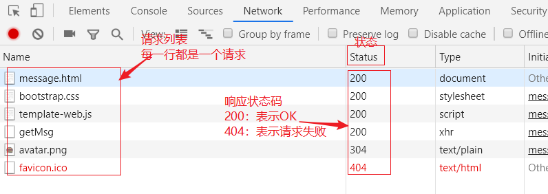
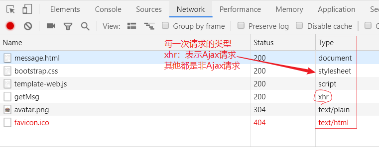

# 前言

- 发微博案例（之前的案例）
    - 可以在输入框输入内容，点击确定，实现发布微博效果
    - 刷新页面，恢复到初始状态。说明**数据并没有真正保存**
    - 只能自己访问（查看、浏览）自己的页面，**其他人无法访问你的案例**
- 留言板案例
    - 可以在输入框输入内容，点击确定，实现发布留言功能
    - 刷新页面，发布的数据不会丢失。**说明数据被永久保存了**
    - **通过IP地址，其他人也可以访问留言板案例**

**案例对比**：

两个案例中，发微博案例更像是一个“单机程序“，就是一个网页；

留言板案例更像是一个真实的网站。之所以有如此大的区别，是因为留言板案例使用了==Ajax==和==服务器==相关知识。Ajax和服务器端编程正是这个阶段的主要内容。

------

# 服务器介绍

## 客户端和服务器

- 客户端：
    - 当你使用自己的计算机来访问（留言板）网站的时候，你的计算机就是客户端
    - 你使用的浏览器来访问网站的，所以也可以认为浏览器就是客户端。
- 服务器：
    - 我们访问的所有网页都在服务器上，比如百度的页面，比如留言板页面
    - 你访问的留言板网站搭建在老师的计算机上，老师的计算机就是服务器

> 客户端比较好理解，就是自己的计算机，接下来着重了解一下什么是服务器。

## 什么是服务器

- Q1：留言板这个HTML页面在你自己的计算机上吗？它在哪里？

    - 不在自己的计算机上，在服务器上。

- Q2：大家发的留言（数据），在哪里保存着呢？

    - 在服务器上

    服务器能够保存网页，能够保存网页中使用的数据。

- Q3：为什么要用服务器？

    - 有了服务器，网页才能够被所有人访问；
    - 有了服务器，数据也能够永久保存

- Q4：老师的电脑为什么能当做服务器？我自己的电脑能不能当服务器用？

    - 因为老师的电脑上安装了服务器软件
    - 同学们的电脑也可以当服务器，只需要安装服务器软件即可

- Q5：常用的服务器软件有什么？我们选择哪个软件来学习？

    - Apache 
    - Tomcat
    - 自己写的服务器软件（源代码）

小结：

1. 服务器就是一个安装了服务器软件的计算机；
2. 服务器可以永久保存数据；
3. 服务器上的资源（html、css、js、图片、数据等等）可以被所有人访问。
4. 真实的服务器也是一个计算机。

------

# 请求响应过程

了解了什么是客户端和服务器，那么问题来了，在自己的计算机（客户端）的浏览器上输入服务器的IP地址，按下回车，直至看到留言板网站。这个过程是怎样的呢？

要理解这个过程，先看一个生活中的场景：

你去商场买东西的过程

- 从家出发，通过地图找到商店的位置
- 你走到商场，并买了一个mac电脑
- 抱着mac电脑一路跑回家
- 到家，在家可以看到mac电脑，玩电脑


客户端浏览器如何访问服务器

- 在浏览器中输入IP地址，告诉客户端服务器的位置(找商场的位置)
- 浏览器通过web这条路(网络)，走到服务器去向服务器要数据(网页/留言数据)   (买了一个电脑)
- 服务器知道你要的数据后，把数据通过web这条路(网络)给你   (抱着电脑回家)
- 客户端浏览器接收到数据后把数据(网页/数据)显示出来    (家里能看到这个电脑，可以玩电脑)


上述，**从浏览器输入IP地址，到看到留言板页面，这一整个过程称之为==请求响应==过程**。

- 请求（Request），指浏览器向服务器发出的请求（请求HTML页面和留言数据）；
- 响应（Response），指服务器接收到浏览器的请求后，做出的回应（把请求的东西给你）；

> 有的时候，为了看到一个页面，也许会向服务器发很多次请求。


# 浏览器工具

## 查看请求基本信息

如果需要了解请求及响应过程。也可以使用浏览器工具，而且多数情况都是通过浏览器工具来分析学习的



## 请求类型(Request Type)

通过浏览器工具，可以查看到请求的类型，我们将请求类型分为两类即可：

- Ajax类型的请求：通过浏览器工具，查看请求的Type列，标注为xhr的，就是Ajax请求
- 非Ajax类型的请求：通过浏览器工具，查看请求的Type列，标注为document、stylesheet等，就是Ajax请求



## 请求方式(Request Method)

浏览器在向服务器发送请求的时候，也分为不同的请求方式。

请求方式共有数十种，但是主要的请求方式就两种，一种为GET方式，一种为POST方式。

- GET 得到，意思浏览器的目的是希望从服务器得到一些东西
- POST 投递，提交，意思是浏览器希望将数据提交给服务器

还是使用浏览器工具来查看


## 查看响应结果(Response)

当浏览器向服务器发送了一个请求后，服务器会根据请求，做出响应。

响应，即将浏览器请求的内容返回给浏览器。


# 搭建服务器环境

## 安装Node

将下载的node软件安装（一直下一步即可）

## 使用node运行app.js开启服务

- 如何搭建web服务环境
    - 将老师发给你的ajax.zip解压缩，得到ajax文件夹。
    - 使用vscode打开ajax文件夹
    - 在编辑器中，在app.js上右键，选择在终端中打开
    - 在打开的终端面板中，输入 `node app.js` 回车，表示开启服务了。

## 其他问题

- 我们的代码文件放哪里？
    - 放在 public 文件夹中。

- 为什么要使用老师写的代码当做服务器
    - 贴合学习，安装配置简单方便
    - 内置了很多学习阶段用的数据接口

## 什么是数据接口

就是一个请求地址，向这个地址发送请求，可以得到一些数据。

网上有很多网站专门提供数据接口？比如天气信息接口（<https://www.tianqiapi.com/api/?version=v1>）、IP地址接口、新闻头条接口等等。


下面的表格中的接口，就是ajax服务器提供的一些测试接口。这些接口在别的服务器软件上是没有的，是老师提前写好的，用于学习使用的。我们后面自己也可以写这样的接口。

| 请求方式 | 接口地址    | 参数                                | 返回值                              |
| -------- | ----------- | ----------------------------------- | ----------------------------------- |
| GET      | /time       |                                     | 时间戳 [string]                     |
| GET      | /query-get  | 任意                                | 发送给服务器的参数 [string]         |
| POST     | /query-post | 任意                                | 提交给服务器的数据 [string]         |
| POST     | /checkUser  | username:[string]                   | true或false                         |
| GET      | /big-data   |                                     | 返回一百万次时间戳 [string]         |
| GET      | /getMsg     |                                     | 返回所有留言[JSON]                  |
| POST     | /addMsg     | name:[string]<br />content:[string] | 添加成功：true<br />添加失败：false |
| POST     | /fd         | FormData对象                        | 提交给服务器的数据 [JSON]           |


# Ajax简介

字面意思：**A**（asynchronous）**j**（javascript）**a**（and）**x**（xml），翻译过来是 “异步的JavaScript和XML”。

简单来说，Ajax是一种技术、是能够使浏览器和服务器进行交互（请求响应）的一种技术。

Ajax也是一套内置在浏览器端的API，核心对象是 `XMLHttpRequest` ，通过这些API的调用，可以实现发送Ajax类型的请求和收取服务器端响应的数据。


# 发送 Ajax 请求

## 初体验

Ajax的核心是内置在浏览器中的 `XMLHttpRequest` 对象。我们可以通过调用这套API，实现发送Ajax请求。

在public文件夹中，创建01-ajax.html ，代码如下：

```html
<body>
    <h1>ajax初体验</h1>

    <script>
        // 1. 创建浏览器内置的对象 XMLHttpRequest，简称xhr对象
        var xhr = new XMLHttpRequest();
        // 2. 调用xhr对象的open方法，设置请求方式和请求的url
        xhr.open('GET', '/time');
        // 3. 调用xhr对象的send方法，向服务器发送请求
        xhr.send();
        // 4. 当请求响应整个过程结束，然后接收服务器响应的结果（返回的数据）
        xhr.onload = function () {
            // 使用xhr的response属性来接收服务器响应的结果
            console.log(xhr.response)
        }
    </script>
</body>
```

浏览器访问  `自己的IP:4000/01-ajax.html` 就可以通过浏览器工具查看到有一次ajax请求

## 难点

Q1：01-ajax.html 为什么要通过IP地址来访问，能不能双击打开？

​	不能双击打开。html文件在public文件夹中，public文件夹是服务器上的文件夹。访问服务器上的资源必须使用服务器的IP地址才行。

Q2：刷新01-ajax.html 是如何看到时间戳的？

 	1. 当地址栏输入 01-ajax.html  按回车，表示向服务器请求该html页面
 	2. 服务器收到请求后，会做出响应，即把html代码返回给浏览器
 	3. 浏览器接收到html代码后，解析这些html代码
 	4. 当解析到js代码的时候，发现又是一次Ajax请求，所以又发送了Ajax请求
 	5. 服务器收到Ajax请求，然后会把时间戳返回给浏览器


# Ajax 发送 GET 方式的请求

## Ajax发送 GET 请求及简化URL

- get 请求

    - get 字面意思获取，一般用户从服务器获取数据

- 一个通用的IP地址

    - 127.0.0.1  始终可以访问到本机的服务器

    - localhost  始终可以访问到本机的服务器

- 如果访问的HTML页面和请求的数据接口是同一个服务器上的资源，IP地址可以省略

    ```js
    // 省略前的写法
    xhr.open('GET', 'http://127.0.0.1:4000/time');
    xhr.open('GET', 'http://localhost:4000/time');
    // 省略后的写法
    xhr.open('GET', '/time');
    ```

- 代码实现

    ```html
    <body>
    
        <input type="button" id="btn" value="请求">
    
        <script>
            // 点击按钮的时候，发送ajax请求
            document.getElementById('btn').onclick = function () {
                // 1. 创建 XHR 对象
                var xhr = new XMLHttpRequest();
                // 2. 调用open方法，设置请求方式和url（接口）
                // xhr.open('GET', 'http://127.0.0.1:4000/time');
                xhr.open('GET', '/time');
                // 3. 调用send方法，发送请求
                xhr.send();
                // 4. 当请求响应过程结束，才接受服务器响应的结果
                xhr.onload = function () {
                    // console.log(xhr.response);
                    console.log(this.response);
                }
            }
        </script>
    </body>
    ```

在发送Ajax请求的时候，比如A、B两个网页文件或接口地址都属于同一个服务器上的资源，则请求URL可以省略前面的IP和端口，直接用`/time` 即可。浏览器在解释 `/time` 的时候，会自动补充完整的URL。

```js
// 1. 创建一个 xhr 对象
var xhr = new XMLHttpRequest();
// 2. 设置请求的方式和路径

//////////////////////////////  注意，下面的URL接口就是简化后的写法。
xhr.open('GET', '/time');

// 3. 发送请求
xhr.send(null);
// 4. 注册事件
xhr.onload = function () {
    // 通过 xhr 的 responseText 获取到响应的响应体
  	console.log(this.responseText)
}
```

## GET 请求传参

- 什么时候需要带请求参数

    - 请求参数又叫做查询字符串
    - 一般用于告诉服务器此次请求的详细目的，比如查询什么、删除哪条记录等

- URL 携带查询字符串

    - 格式：http://www.baidu.com/s?q=word&sug=5017
    - 查询字符串(querystring)：
        - URL中==问号后面==携带的就是 get 请求传参的数据，叫做查询字符串
        - 格式：aa=xxx&bb=yyyy
        - 查询字符串只适合传输少量数据

- 代码演示：

    ```html
    <body>
    
        <input type="button" id="btn" value="发送请求">
    
        <script>
            // 点击按钮的时候，发送ajax请求
            document.getElementById('btn').onclick = function () {
                // 1. 创建xhr对象
                var xhr = new XMLHttpRequest();
                // 2. 调用open，设置请求（方式、url）
                xhr.open('GET', '/query-get?id=11&age=22');
                // 3. 调用send，发送请求
                xhr.send(null);
                // 4. 当请求响应过程结束后，才获取服务器响应的结果
                xhr.onload = function () {
                    console.log(this.response);
                }
            };
    
        </script>
    
    </body>
    ```

## 缓存问题(了解)

- 只有IE浏览器会有缓存问题，所以作为了解内容
- 缓存问题指的是：两次或多次 AJAX GET 请求**同一个** URL ，IE浏览器在第二次请求的时候，并不会从新向服务器发请求，而是直接使用上次请求的结果。

```html
<body>

    <input type="button" id="btn" value="请求">

    <script>
        // 点击按钮的时候，发送ajax请求
        document.getElementById('btn').onclick = function () {
            // 1. 创建 XHR 对象
            var xhr = new XMLHttpRequest();
            // 2. 调用open方法，设置请求方式和url（接口）
            // xhr.open('GET', 'http://127.0.0.1:4000/time');
            // xhr.open('GET', '/time?abc=' + Math.random());
            xhr.open('GET', '/time?abc=' + Date.now());
            // 3. 调用send方法，发送请求
            xhr.send();
            // 4. 当请求响应过程结束，才接受服务器响应的结果
            xhr.onload = function () {
                // console.log(xhr.response);
                console.log(this.response);
            }
        }
    </script>
</body>
```

- 解决方案

> 让每次请求的URL都不同
>
> 不同的查询字符串(请求参数)会被浏览器认为是不同的地址，浏览器会忽略客户端缓存。

```javascript
var xhr = new XMLHttpRequest()
xhr.open('GET', '/time?t=' + Date.now())
xhr.send(null)
xhr.onload = function () {
  console.log(this.responseText)
  // =>
}
```

# Ajax 发送 POST 方式的请求

post 把传递的数据封装在 HTTP 请求数据中，以键/值的形式出现，可以传输大量数据，对数据量没有限制，也不会显示在 URL 中。

- 字面意思是把数据提交给服务器
- post 请求，**必须调用setRequestHeader方法设置 Content-Type**
    - 请求头中的 Content-Type，告诉服务器发送过去的数据的格式
- 发送的数据
    - send方法的参数就是post方式发送给服务器的数据。（和get不同）
- 代码演示

```js
var xhr = new XMLHttpRequest()
// open 方法的第一个参数的作用就是设置请求的 method
xhr.open('POST', '/query-post')
// 设置 Content-Type 为 application/x-www-form-urlencoded，这行代码不用死记硬背，去复制即可
xhr.setRequestHeader('Content-Type', 'application/x-www-form-urlencoded')
// 需要提交到服务端的数据可以通过 send 方法的参数传递
// 格式：name=zhangsan&age=18
xhr.send('name=zhangsan&age=18')
xhr.onload = function () {
    console.log(this.responseText)
}
```

# 课堂案例-验证用户名

使用的接口是 POST方式的checkUser，参数必须为username，值是注册的用户名；服务器上目前已有zhangsan、lisi、wangwu三个用户了。

```html
<body>
    <input type="text" id="user"><span id="msg"></span>

    <script>
        // 当输入框失去焦点的时候，向接口checkUser发送ajax请求，验证用户名
        document.getElementById('user').onblur = function () {
            // 获取输入的值
            var user = this.value;
            // 发送ajax请求
            var xhr = new XMLHttpRequest();
            xhr.open('POST', '/checkUser');
            xhr.setRequestHeader('Content-Type', 'application/x-www-form-urlencoded');
            xhr.send('username=' + user);
            xhr.onload = function () {
                // console.log(this.response); // 如果返回true，说明用户名已被占用
                if (this.response === 'true') {
                    document.getElementById('msg').innerHTML = '<font color="red">sorry，用户名已被占用</font>';
                } else {
                    document.getElementById('msg').innerHTML = '<font color="green">恭喜，用户名可用</font>';
                }
            }
        }
    </script>
</body>
```

