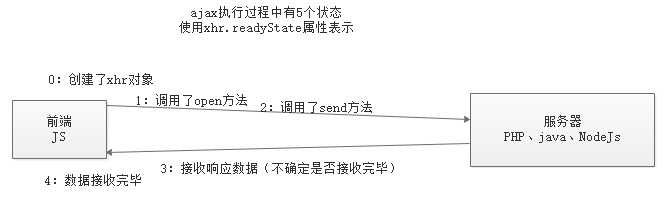

# 1.同步与异步

*Ajax* 即“**==A==synchronous** ==J==avascript ==A==nd ==X==ML”（**异步** JavaScript 和 XML）

单词：

Asynchronous -- 异步的，不同步的

synchronous -- 同步的

Deprecation -- 反对的，不赞成的，不期望的

关于同步与异步的概念在生活中有很多常见的场景，举例说明。

> - 同步：一个人在同一个时刻只能做一件事情，在执行一些耗时的操作的时候，不能去做别的事，只是等待
> - 异步：在执行一些耗时的操作的时候，同时去做别的事，而不是等待

`xhr.open()` 方法第三个参数要求传入的是一个 `bool` 值，其作用就是设置此次请求是否采用异步方式执行，默认为 `true`，表示异步操作。如果需要同步执行可以通过传递 `false` 实现：

分析下面的代码：

```javascript
console.log('111')
var xhr = new XMLHttpRequest()
// 默认第三个参数为 true 意味着采用异步方式执行
xhr.open('GET', '/time', true)
xhr.send(null)
xhr.onload = function () {
    // 这里的代码最后执行
    console.log('ajax')
}
console.log('222')
```

上述代码，先执行 `console.log('111')`，然后是发送异步的Ajax请求，最后执行 `console.log('222')`，试想，输出的顺序是怎样的？

**答**：移除输出 `111`、`222`、`ajax`。因为代码执行顺序是从上到下依次执行的，所以最先输出 `111` ，下面是执行Ajax请求，它是一个异步的耗时操作，需要等待服务器的响应，只有服务器响应的结果完整的被xhr对象接收，才会输出 `ajax`，因为它是异步操作，不会阻塞后续代码的执行，所以后续输出 `222` 这行代码的执行，无需等待 Ajax操作是否结束。

下面的代码，设置 `open` 的第三个参数为 `false`，则表示同步方式的ajax请求，如果采用同步方式执行，则代码会卡死在 `xhr.send()` 这一步：

```javascript
console.log('111')
var xhr = new XMLHttpRequest()
// 同步方式
xhr.open('GET', '/time', false)
// // 同步方式 执行需要 先注册事件再调用 send，否则 onload 事件无法触发
 xhr.onload = function () {
     // 会按代码执行顺序执行这行代码
     console.log('ajax')
}
xhr.send(null)
// 因为 send 方法执行完成 响应已经下载完成
console.log(xhr.responseText)
console.log('222')
```

> 了解同步模式即可，切记不要使用同步模式。

# 2.XHR对象其他API

## 2.1 readyState和onreadystatechange

#### readyState



既然Ajax请求是一个耗时操作，也就是从开始创建 xhr 对象，然后调用open、调用send发送请求到服务器（耗时）、·（耗时）、接收服务器返回的数据、完全接收到服务器返回的数据，这一整个过程是耗时的操作，即使网速再快也需要一定的时间。

换句话说，在执行Ajax请求响应过程中，要经过好几个阶段，xhr 对象提供了一个属性 readyState ，用它来表示 Ajax请求到哪个阶段了。

输出 xhr.readyState 会得到 0、1、2、3、4几个数字，他们分别表示 Ajax请求响应的各个阶段，每个数字表示的意思如下：

| readyState | 状态描述         | 说明                                                         |
| ---------- | ---------------- | ------------------------------------------------------------ |
| 0          | UNSENT           | 代理（XHR）被创建，但尚未调用 `open()` 方法。                |
| 1          | OPENED           | `open()` 方法已经被调用，建立了连接。                        |
| 2          | HEADERS_RECEIVED | `send()` 方法已经被调用，并且已经可以获取状态行和响应头。    |
| 3          | LOADING          | 响应体（服务器返回的数据）下载中， `responseText` 属性可能已经包含部分数据。 |
| **4**      | **DONE**         | **响应体（服务器返回的数据）下载完成，可以直接使用 `responseText`或response 获取完整的结果。** |

> 一般都不说Ajax请求响应的几个阶段，大多数都说Ajax的几个状态，也就是说readyState表示Ajax请求过程中的几个状态。

#### onreadystatechange

onload是H5之后新增的事件，在H5之前，都是使用onreadystatechange。

on... 表示一个事件，翻译过来就是“当...时候”，readystate前面说过，是一个数字，表示ajax的状态，change是改变的意思。所以这个事件的意思是，当Ajax状态发生变化的时候，就会触发这个事件。

```js
var xhr = new XMLHttpRequest()；
// 创建对象后，先打印一次XHR对象的状态，此时状态值为0
console.log(xhr.readyState);

// 添加事件onreadystatechange，每当XHR对象的状态发生变化的时候，就会触发这个事件
// 比如
// xhr对象的状态从0-->1，会触发下面的事件
// xhr对象的状态从1-->2，会触发下面的事件
// xhr对象的状态从2-->3，会触发下面的事件
// xhr对象的状态从3-->4，会触发下面的事件
xhr.onreadystatechange = function () {
    console.log(this.readyState); 
    // 输出1/2/3/4
}
// open 方法的第一个参数的作用就是设置请求的 method
xhr.open('POST', '/query-post')
// 设置 Content-Type 为 application/x-www-form-urlencoded，这行代码不用死记硬背，去复制即可
xhr.setRequestHeader('Content-Type', 'application/x-www-form-urlencoded')
// 需要提交到服务端的数据可以通过 send 方法的参数传递
// 格式：name=zhangsan&age=18
xhr.send('name=zhangsan&age=18');
```

#### xhr对象分块接收数据

如果服务器返回的数据量非常大，xhr对象是分块接收数据的，一次性接收一部分（大小不确定），直至接收完毕为止。

注意的是，当xhr对象接收的数据发生变化的时候，这里readyState的值不会发生变化，一直为3，但接收到的数据变化了，也表示ajax的状态变化了，此时也会触发onreadystatechange事件。

```js
var xhr = new XMLHttpRequest()；

xhr.onreadystatechange = function () {
    conso.log('数据：' + this.responseText.length); // 数据非常长，输出它的长度看效果即可
    console.log('Ajax状态：' + this.readyState);  // 3表示正在接收数据，最后一次4表示接收完毕
}
// 这里调用 /big-data 接口，它返回100万次时间戳
xhr.open('GET', '/big-data')
xhr.send()；
```

## 2.2 onprogress

progress -- 过程，进度

这也是 xhr 对象中的一个事件，当正在接收服务器返回数据的时候，它会触发。

```js
var xhr = new XMLHttpRequest()；

xhr.onreadystatechange = function () {
    conso.log('数据：' + this.responseText.length); // 数据非常长，输出它的长度看效果即可
    console.log('Ajax状态：' + this.readyState);  // 3表示正在接收数据，最后一次4表示接收完毕
}

xhr.onprogress = function () {
    // 此时，ajax的状态值为 3
    console.log('正在下载数据，请稍后');
}

// 这里调用 /big-data 接口，它返回100万次时间戳
xhr.open('GET', '/big-data')
xhr.send()；
```


另外下面还有几个补充的事件及所表示的意义：

- onload -- 当readyState等于4的时候触发。只有请求成功了才触发。
- onprogress -- 当readyState等于3的时候触发（数据正在返回途中的时候触发）
- onloadstart() -- 当开始发送请求的时候触发，要放到send之前
- onloadend() -- 当请求响应过程结束的时候触发。无论成功还是失败都会触发。

## 2.3 创建XHR对象的兼容方案

XMLHttpRequest 在老版本浏览器（IE5/6）中有兼容问题，可以通过另外一种方式代替。

```javascript
var xhr = window.XMLHttpRequest ? new XMLHttpRequest() : new ActiveXObject('Microsoft.XMLHTTP')
// xhr 的成员相同，即后续的open、send方法一样使用、onreadystatechange
```

## 2.4 responseType

`responseType`，表示预期服务器返回的数据的类型，当设置了该属性后，通过 `response` 接收数据的时候，会根据该属性的值来自动处理结果为JS能够识别的数据。

比如，当设置了 `responseType='json'`  后，使用 `response` 来接收服务器返回的数据时，会自动处理 JSON 数据为 JS 数组，免去了 `JSON.parse()` 这一步。

responseType的可选值为下面几个：

- “”  -- 空，表示文本，和text一样。空为默认值
- text -- 文本
- json -- JSON格式数据
- document -- 文档对象。当服务器返回的结果是XML类型的时候，需要指定为document

```js
var xhr = new XMLHttpRequest();
xhr.onload = function () {
    // 因为指定了responseType为json。所以ajax会自动将服务器返回的结果当做json来处理
    // 会自动调用JSON.parse来将结果处理成JS数据
    console.log(this.response);
}
xhr.open('GET', '/getMsg');
// send之前，指定预期服务器返回数据的类型
xhr.responseType = 'json'; // 可选的值 '' 、 text 、 json 、 document
xhr.send();
```


## 2.5 API小结

- XHR 1 版 API
    - open
    - send
    - readyState
    - onreadystatechange
    - responseText：用于接收服务器返回的文本类型的结果
- XHR 2.0 新增API
    - onload
    - onprogress
    - onloadstart
    - onloadend
    - response ：可以接收任何的结果
    - responseType：配合response使用的一个属性

# 3.H5新增FormData对象(重点)

Date() -- 日期

Data -- 数据 

FormData是h5中新增的一个内置对象。

FormData对象用以将数据编译成键值对，以便用`XMLHttpRequest`来发送数据。其主要用于发送表单数据，但亦可用于发送带键数据(keyed data)，而独立于表单使用。

以前 AJAX 操作只能提交字符串，现在可以提交 **二进制** 的数据

- 使用方法一（有form表单）

    ```html
    <form id="fm">
        <input type="text" name="user"><br>
        <input type="password" name="pwd"><br>
        <input type="radio" name="sex" value="男" checked>男
        <input type="radio" name="sex" value="女">女<br>
        <input type="file" name="pic"><br/>
        <input type="button" id="btn" value="提交">
    </form>
    
    <script>
        // 当点击提交按钮的时候，需要把表单各项的值，提交给fd接口。
            document.getElementById('btn').onclick = function () {
                // 获取各项值
                /* var user = document.getElementsByName('user')[0].value;
                var pwd = document.getElementsByName('pwd')[0].value; */
    
                // FormData 专门用于收集表单各项值
                // 1. 有表单，找到表单
                var form = document.getElementById('fm');
                // 2. 实例化FormData，将表单的DOM对象传入即可
                var fd = new FormData(form); // fd对象中包含了表单所有的值
    
                // 将各项值发送给fd接口
                var xhr = new XMLHttpRequest();
                xhr.open('POST', '/fd');
                // xhr.setRequestHeader('Content-Type', 'application/x-www-form-urlencoded');
                xhr.responseType = 'json';
                xhr.send(fd);
                xhr.onload = function () {
                    console.log(this.response);
                }
            }
    </script>
    ```

    ==上述使用FormData的时候，form表单中的各项必须有name属性。没有name属性是收集不到数据的==

- 使用方法二（没有form表单）

    ```php+HTML
    <input type="text" id="user"><br>
    <input type="password" id="pwd"><br>
    <input type="file" id="pic"><br/>
    <input type="button" id="btn" value="提交">
    
    <script>
        // 点击提交按钮的时候，把数据发送给fd接口
            document.getElementById('btn').onclick = function () {
                // 收集表单数据
                // 1. 先实例化FormData
                var fd = new FormData();
                // 2. 调用FormData内置的方法append，向fd对象中，添加值
                // fd.append(key, value);
                fd.append('username', document.getElementById('user').value);
                fd.append('pwd', document.getElementById('pwd').value);
                // 如果是文件的话，必须使用文件对象
                var file = document.getElementById('pic');
                // console.dir(file);
                var fileObj = file.files[0];
                // fd.append('myfile', 文件对象);
                fd.append('myfile', fileObj);
    
                var xhr = new XMLHttpRequest();
                xhr.open('POST', '/fd');
                xhr.responseType = 'json';
                xhr.send(fd);
                xhr.onload = function () {
                    console.log(this.response);
                }
            }
    </script>
    ```

jQuery中使用FormData：

```html
	<form id="fm">
        <input type="text" name="user"><br>
        <input type="password" name="pwd"><br>
        <input type="radio" name="sex" value="男" checked>男
        <input type="radio" name="sex" value="女">女<br>
        <input type="file" name="pic"><br />
        <input type="button" id="btn" value="提交">
    </form>

    <script src="/jquery.js"></script>
    <script>

        $('#btn').click(function () {
            var fm = $('#fm');
            var fd = new FormData(fm[0]); // 这里fm必须是DOM对象
            console.log(fd);

            $.ajax({
                type: 'post',
                url: '/fd',

                // 如果data使用的是对象，ajax方法会把对象转成字符串，
                // 即把{name: 'zs', age: 18}转成name=zs&age=18
                // data: {name: 'zs', age: 18}, 
                data: fd,
                // processData: false, 表示不让jQuery把fd对象转成字符串，而是直接发送fd对象
                processData: false,
                // contentType：false，表示不让jQuery去设置content-type，让FormData去处理
                contentType: false,
                success: function (res) {
                    console.log(res);
                }
            });
        });


        // xhr.send('name=zs&age=18');

    </script>
```


参考链接：

https://developer.mozilla.org/zh-CN/docs/Web/API/FormData/Using_FormData_Objects

# 4. 封装

## 4.1 jQuery 中封装的 AJAX

jQuery 中有一套专门针对 AJAX 的封装，功能十分完善，经常使用，需要着重注意。

> 一个你会用我会用他会用到的点，就一定有一个已经封装好的

> 参考：
>
> - http://www.jquery123.com/category/ajax/
> - http://www.w3school.com.cn/jquery/jquery_ref_ajax.asp

### 4.1.1 $.ajax

基本的使用：

```js
$.ajax({
    // 属性：值
    // type: 'GET', // type表示请求方式，默认就是GET方式
    url: '/time', // url表示接口地址
    // data: 'id=111&age=222', // 发送给服务器的参数
    // dataType: 'json', // 预期服务器返回数据的类型
    success: function (result) {
        console.log(result);
    }
});
```

其他选项：

```javascript
$.ajax({
  url: '/time',
  type: 'get',
  dataType: 'json',
  data: { id: 1 },
  beforeSend: function (xhr) {
    console.log('before send')
  },
  success: function (data) {
    console.log(data)
  },
  error: function (xhr) {
    console.log(xhr)
  },
  complete: function (xhr) {
    console.log('request completed')
  }
})
```

常用选项参数介绍：

- cache: 设置ie浏览器的缓存问题， cache: false 不缓存
- url：请求地址
- type：请求方法，默认为 `get`
- dataType：预期服务端响应数据类型
- contentType：请求体内容类型，如果是POST请求，默认 `application/x-www-form-urlencoded`
- data：（object|string）传递到服务端的数据
- timeout：请求超时时间
- beforeSend：请求发起之前触发
- complete：请求完成触发（不管成功与否）
- success：请求成功之后触发（响应状态码 200）
- error：请求失败触发
- processData：是否让jQuery帮我们将发送给服务器的数据进行处理（默认：true表示将对象处理成字符串）

### 4.1.2 jQuery封装的发送Ajax请求的快捷方法

**GET 请求快捷方法**

`$.get(url, [data], [callback], [dataType])`

`$.get({settings})`

**POST 请求快捷方法**

`$.post(url, [data], [callback], [dataType])`

`$.post({settings})`

```html
<script src="./jquery.js"></script>
<script>
    // $.get(请求的接口, 发送到服务器的数据, 用于处理服务器返回结果的函数, 预期服务器返回数据的类型);

    /* $.get('/time', function (result) {
            console.log(result);
        }); */

    /* $.get('/query-get', {id: 123, age: 345}, function (result) {
            console.log(result);
        }, 'json'); */

    $.post('/query-post', {id: 123, age: 345}, function (result) {
        console.log(result);
    }, 'json');

</script>
```


### 4.1.3 全局事件处理

每次Ajax请求都需要的事件，比如给一个请求响应过程进度提示，可以使用全局事件处理。反过来说，通过全局事件处理的事件，**后续**的每个ajax请求都会触发。

- 语法

    - `$.ajaxSetup({事件: 处理函数, 事件:处理函数, ...});`

- 示例

    ```js
    // 设置全局事件处理
    $.ajaxSetup({
        // 设置发送请求前的事件
        beforeSend: function () {
            // 这里可以提示，玩命加载中...
        },
        // 设置完全接收响应数据后的事件
        complete: function () {
            // 这里可以去掉“玩命加载中...”
        }
    });
    ```

- 进度提示插件--NProgress

    - https://github.com/rstacruz/nprogress

参考链接：

> http://www.jquery123.com/category/ajax/global-ajax-event-handlers/

#### 自学内容（作业）

- `$(selector).load()`
- `$.getJSON()`
- `$.getScript()`

简单概括以上方法的作用和基本用法。

## 4.2 其他封装库 Axios（了解）

Axios 是目前应用最为广泛的 AJAX 封装库，相对于 jQuery 的优势在于功能能强劲，职责更单一，后期专门有介绍。

```javascript
axios.get('/time')
  .then(function (res) {
    console.log(res.data)
  })
  .catch(function (err) {
    console.error(err)
  })
```

> *扩展：https://github.com/axios/axios

## 4.3 自己封装ajax函数

前面发送ajax请求的时候，总是要写大量重复的代码，用起来非常麻烦，为了简化ajax的使用，自己封装一个函数。

> 函数就可以理解为一个想要做的事情，函数体中约定了这件事情做的过程，直到调用时才开始工作。

```javascript
        
        // 3. 设置函数的参数，让函数变得更加灵活，更加强大
        // 3.1 处理发送给服务器的数据（GET请求拼接到url后面，POST请求放到send里面）
        // 3.2 POST方式请求，添加header
        function ajax(method, url, data, done) {
            var xhr = new XMLHttpRequest();

            // 统一将method转换成大写，方便后续判断
            method = method.toUpperCase();

            // 判断，data如果是对象，则处理成 aa=xx&bb=yy 这种形式
            var arr = [];
            if (data instanceof Object && data instanceof Array !== true) {
                // data = {id=456, age:789};
                for (var key in data) {
                    arr.push(key + '=' + data[key]);
                }
                data = arr.join('&');
            }

            // 统一处理url
            if (method === 'GET') {
                url = data ? url + '?' + data : url;
            }
            // open必须放到设置header之前
            xhr.open(method, url);

            // 先设置一个表示发送到服务器的数据的变量
            var d = null;
            if (method === 'POST') {
                d = data;
                xhr.setRequestHeader('Content-Type', 'application/x-www-form-urlencoded');
            }

            xhr.send(d);
            
            xhr.onload = function () {
                // 处理服务器返回的数据，处理方式不一样
                // console.log(xhr.responseText);
                done(xhr.responseText);
            }
        }

        /* function done1 (result) {
            console.log(result);
        }

        function done2 (result) {
            alert(result);
        }

        ajax('get', '/query-get', 'id=1&age=22', done1);
        ajax('post', '/query-post', 'name=zs&sex=M', done2); */
        ajax('get', '/query-get', 'id=1&age=22', function (result) {
            console.log(result);
        });
        ajax('post', '/query-post', 'name=zs&sex=M', function (result) {
            alert(result);
        });

```

