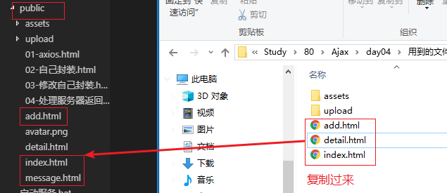
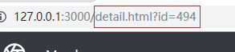
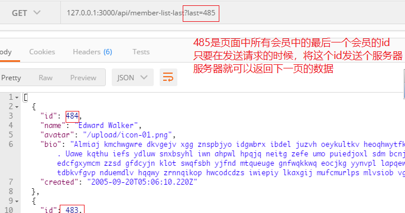
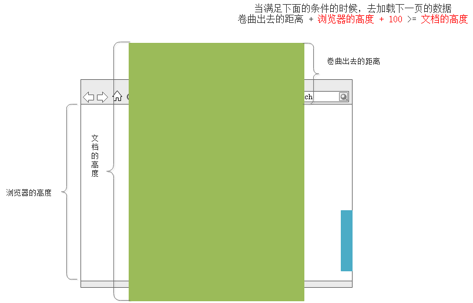

# Axios封装库

Axios 它是一个封装库，封装了ajax请求使用的一些方法。

它比jQuery更专业，专注于处理ajax请求的，这个封装库中没有其他的封装。体积大约10k。

能够使用axios发送一次请求就可以

```html
<script src="./assets/axios.js"></script>
<script>
    // 试着使用axios发送一次ajax请求
    axios.get('/time').then(function (res) {
        console.log(res);
    });
</script>
```


# 自己封装Ajax

自己封装的目的是为了**提高编程能力，锻炼逻辑思维能力**。另外封装Ajax还能体会到==回调函数==的作用，即使用回调函数来处理异步请求的结果。

```js
// 3. 把可变的位置换成参数
function ajax(type, url, data, fn) {
    var xhr = new XMLHttpRequest();

    if (type === 'GET') {
        xhr.open(type, url + '?' + data);
        xhr.send(null);
    }
    if (type === 'POST') {
        xhr.open(type, url);
        xhr.setRequestHeader('Content-Type', 'application/x-www-form-urlencoded');
        xhr.send(data);
    }

    xhr.onload = function () {
        fn(this.response);
    }
}

// function chuli (r) {
//     console.log(r);
// }

// ajax('GET', '/getMsg', null, chuli);
ajax('GET', '/getMsg', null, function (r) {
    console.log(r);
});
/* $.get('/getMsg', null, function (r) {
            console.log(r);
        }); */

ajax('POST', '/addMsg', 'name=zs&content=lisi', function (res) {
    console.log(res);
});
```


# Ajax综合案例

## 1. 用到的接口列表

#### GET /api/member-list

获取会员数据列表，返回数组

##### 参数

- page: 如果传递 page，则分页获取指定页的 6 条数据
- last: 如果传递 last，则获取指定 ID 之后的 6 条数据

#### GET /api/member-detail

获取指定 ID 对应的数据

##### 参数

- id: 需要获取的数据 ID

#### GET /api/member-delete

根据id删除数据

##### 参数

- id: 需要根据id删除

#### POST /api/member-add

添加一个新的会员

##### 参数

- name: 会员名称
- bio: 会员简介
- avatar: 头像文件

#### GET /api/member-list-last

获取下拉分页数据

##### 参数

- last: 如果为null，默认获取第一页数据；如果需要获取下一页的数据，则需要传递当前已显示的会员中的最后一个会员的id

## 2. 实现会员列表功能

删除public里面的index.html 、add.html 、detail.html、index-data.html。

复制资料中的index.html 、add.html 、detail.html 三个文件到public文件夹。




1. 页面加载，发送Ajax请求到对应的接口`/api/member-list-last`，获取6个会员
2. 通过模板引擎将响应数据渲染到页面中

- 模板代码

```html
<script id="moban" type="text/html">
    {{each arr}}
    <div class="col-lg-4 col-md-6">
        <div class="card mb-4">
          <div class="card-img-top py-4 bg-dark text-center">
            
            <h3 class="card-title text-light">{{$value.name}}</h3>
    </div>
          <div class="card-body">
            <p class="card-text">{{$value.bio}}</p>
            <a href="#" class="card-link">View</a>
            <a href="#" class="card-link text-danger">Delete</a>
    </div>
    </div>
    </div>
      {{/each}}
</script>
```

- ajax代码

```js
/////////////////////////////////////////////////////////////
// 页面刷新，获取6个会员
$.get('/api/member-list-last', {last: null}, function (res) {
    console.log(res);
    // 使用模板引擎将数据显示到页面上
    // 调用template函数
    var str = template('moban', {
        arr: res
    });
    // 把模板和数据组合好的结果放到div#members里面
    $('#members').append(str);
}, 'json');
```

> 调用 `/api/menber-list` 接口获取的是全部会员，加载的时候非常慢，所以可以使用 `/api/member-list-last`接口，该接口只获取6个会员，这样刷新页面后，只会看到最新的6个会员，加载速度比较快。

## 3. 实现查看会员详细信息


1. 点击 “View” 超链接，跳转到 `/detail.html` ，跳转时**一定要携带**该会员的id

    ```html
    <!--index.html页面中，循环模板的时候，给每个View都挂这个超链接-->
    <a href="/detail.html?id={{$value.id}}" class="card-link">View</a>
    ```

2. 点击View，会跳转到detail.html中，并且还带有id参数

    

3. 到detail.html中，获取地址栏的id值

    ```js
    // var id = location.search.replace(/\D/g, ''); // 482
    var id = location.search;  // ?id=498
    ```

4. `detail.html` 中获取到会员id后，调用接口`/api/member-detail`获取该会员的信息

5. 将获取到的信息展示在页面中

```html
<!-- detail.html 页面中的模板 --->
	<script id="moban" type="text/html">
    <div class="container">
      
      <h1 class="display-4">{{name}}</h1>
      <p class="lead text-muted">{{bio}}</p>
      <div>
        <a href="#" class="btn btn-primary my-2">Edit</a>
        <a href="#" class="btn btn-danger my-2">Delete</a>
      </div>
    </div>
  </script>
```

```js
//////////////////////////////////////////////
    // 获取地址栏的id
    // var id = location.search.replace(/\D/g, ''); // 482
    // console.log(id);
    var id = location.search; // ?id=482
    // 发送ajax请求到 /api/member-detail 接口，获取当前的会员
    $.get('/api/member-detail' + id, function (res) {
      console.log(res);
      // 调用template函数
      var str = template('moban', res);
      // 把组合好的结果放到section标签里面
      $('section').html(str);
    }, 'json');
```


## 4. 实现删除会员功能

1. 点击超链接不能跳转，设置href属性为javascript:;

2. 使用事件委托的方式来注册单击事件（给body注册单击事件，委托给 delete标签）

3. 提示是否要删除（因为删除是敏感操作，必须要提示）

4. 在delete标签上设置自定义属性 data-id ，值就是当前这个会员的id

    ```html
    <a href="javascript:;" data-id="{{$value.id}}" class="card-link text-danger">Delete</a>
    ```

5. 调用接口 `/api/member-delete` ，并携带id参数，完成删除

6. 删除成功后，将当前的会员移除掉即可

```js
//////////////////////////////////////////////////////////////
    // 删除功能
    // 点击删除超链接的时候，获取当前会员的id，调用 /api/member-delete 删除即可
    // 给删除添加单击事件，必须使用事件委托，因为a标签是后来添加到页面中的元素
    $('body').on('click', '.text-danger', function () {
      if (!confirm('你确定要删除吗？')) {
        return;
      }
      // alert(123);
      // 获取当前会员的id
      var myid = $(this).attr('data-id');
      var that = $(this);
      // console.log(id);
      $.get('/api/member-delete', {id: myid}, function (res) {
        if (res.message === '数据删除成功') {
          // 说明删除成功了。移除当前会员所在的div
          that.parents('.col-md-6').remove();
        }
      }, 'json');
    });
```


## 5. 实现新增会员功能

1. 点击index.html中的“New Member”超链接，跳转到add.html

    ```html
    <a href="/add.html" class="btn btn-primary my-2">New member</a>
    ```

2. 新增会员,图片预览功能。

- 图片预览

    - input:file 标签属性介绍

        - accept：限制上传文件的文件类型
            - accept=".jpg,.png,.gif"       一个一个后缀指定
            - accept="image/*"    表示允许任何的图片类型
        - multiple：多选

    - 如何实现图片预览

        - 获取文件的dom对象 `var fileObj = this.files[0]`;
        - 使用h5新增对象URL.createObjectURL(fileObj)，创建临时图片地址，用于预览
        - 设置预览图片的src属性为临时图片地址

        ```js
        	// 根 #input_avatar 添加 change 事件，当文件域的内容发生变化的时候，会触发
            $('#input_avatar').change(function () {
              // 完成文件预览功能
              // 1. 找到文件对象
              var fileObj = this.files[0]; // 文件对象，直接使用this，因为this是DOM对象
              // 2. 使用URL.createObjectURL方法，可以为图片临时生成一个连接，通过这个链接可以查看到图片
              var url = URL.createObjectURL(fileObj);
              // console.log(url);
              // 3. 设置预览图片的src属性为上面的链接即可
              $('.img-thumbnail').attr('src', url);
            });
        
        ```

        

- 提交 FormData

    > 注意事项：接口需要的三个参数分别为 name / bio / avatar
    >
    > 表单中的input需要设置name值，否则FormData是收集不到数据的
    >
    > name值要和接口指定的参数对应。否则不能添加成功

    ```js
    // 2. 点击save的时候，实现添加即可
        $('.btn-block').click(function () {
          // console.log(111);
          // 收集表单中的各项数据
          var form = $('form')[0];
          var fd = new FormData(form);
          // console.log(fd);
          // console.log(fd.get('name'));
          // 将fd对象发送给 /api/member-add 接口
          $.ajax({
            type: 'POST',
            url: '/api/member-add',
            data: fd, // {id: 111, age: 222}, // jQuery会自动将对象转成字符串 id=111&age=222
            dataType: 'json',
            success: function (res) {
              // console.log(res)
              if (res.message === '数据保存成功') {
                // 添加成功，跳转到index.html
                location.href = '/index.html';
              }
            },
            processData: false, // 不让jQuery把data转成字符串
            contentType: false // 不让jQuery设置编码格式为application/x-www-form-urlencoded
          });
        });
    ```

## 6. 实现加载更多功能

思路：当滚动条快接近底部的时候。然后去加载下一页的数据。所以第一：找到滚动条快接近底部的条件；第二分析如何去加载下一页的数据；

1. 接口/api/member-list-last，分页加载会员

    会员较多，一次性加载耗时，可以分页加载，每页有6条数据，即6个会员。该功能通过接口 `/api/member-list-last` 可以实现。

    - 通过改变last参数的值，可以获取到下一页的数据

        

2. 计算出，当滚动条快接近底部的时候，再次调用接口 `/api/member-list-last` ，通过改变参数，获取下一页的6个会员。

    - $(document).height()		     文档的高度

    - $(window).height()                    窗口的高度

    - $(document).scrollTop()           文档滚动出去的距离

        

3. 设置标识，当正在处理当前页数据的时候，不允许再次请求下一页的数据

**具体做法**：

1. 绑定滚动事件，找到何时加载另外的数据那个点

    ```JS
    /////////////////////////////////////////////////////
        // 懒加载
        // 当滚动条滚动的时候，计算卷曲出去的距离、浏览器的高度、文档的高度
        // 当 卷曲出去的距离 + 浏览器的高度 + 100 >= 文档的高度 ，说明滚动条快接近底部
        $(window).scroll(function () {
          var scrollTop = $(document).scrollTop();
          var winHeight = $(window).height();
          var documentHeight = $(document).height();
          if (scrollTop + winHeight + 100 >= documentHeight) {
            // 此时说明 滚动条快接近底部，此时可以去加载另外的数据了
            // 这个判断，非常有可能触发多次
            console.log(124124);
          }
        });
    ```

2. 封装获取6条数据的代码为loadData函数，函数内部在处理数据的时候，重置lastId为当前数据中的最后一个id

    ```js
    	var lastId = null;
    
        // 封装一个函数，实现加载6条数据
        function loadData() {
          $.get('/api/member-list-last', { last: lastId }, function (res) {
            console.log(res); // 得到6条数据
            
            // 调用template函数
            var html = template('list', {
              // key: value
              arr: res
            });
            // 将组合好的结果，放到id为members的div中
            $('#members').append(html);
            // 此时，当前这6条数据处理完毕，此时允许去加载另外的数据了
             // 重置lastId为当前这组中的最后一个id，以便下次loadData调用时使用
            lastId = res[res.length - 1].id;
          });
        }
        // 页面刷新，首先调用一次loadData
        loadData();
    ```

3. 当滚动条快接近底部的时候，去调用loadData即可

    ```js
    $(window).scroll(function () {
        var scrollTop = $(document).scrollTop();  // 卷曲出去的距离
        var winHeight = $(window).height();  // 浏览器的高度
        var documentHeight = $(document).height(); // 文档（页面）的高度
        if (scrollTop + winHeight + 100 >= documentHeight) {
            // 此时去加载下一页的数据
            console.log(12313);  // 注意，这个输出一不小心就会执行多次；也就意味着，一不小心，就会加载多次数据
            loadData();
        }
    });
    ```

    

4. 加入flag，控制何时允许去加载6条数据

    ```js
    var flag = true; // 全局变量，控制此时是否可以去加载更多数据了。默认true表示允许加载
    
    // 在loadData函数中，改变flag的值
    function loadData() {
          flag = false; // 此时正在发送请求，处理数据，不允许在这个时候去加载另外的数据
          $.get('/api/member-list-last', { last: lastId }, function (res) {
            console.log(res); // 得到6条数据
            
            // 调用template函数
            var html = template('list', {
              // key: value
              arr: res
            });
            // 将组合好的结果，放到id为members的div中
            $('#members').append(html);
            // 此时，当前这6条数据处理完毕，此时允许去加载另外的数据了
            // 重置lastId为当前这组中的最后一个id，以便下次loadData调用时使用
            lastId = res[res.length - 1].id;
            flag = true;
          });
        }
    
    
    
    //////////////////////////////////////////////////////////////////////////////
    	// 滚动条滚动时，加入flag判断
    	$(window).scroll(function () {
          var scrollTop = $(document).scrollTop();
          var winHeight = $(window).height();
          var documentHeight = $(document).height();
          if (scrollTop + winHeight + 100 >= documentHeight && flag) {
            // 此时说明 滚动条快接近底部，此时可以去加载另外的数据了
            // 这个判断，非常有可能触发多次
            // console.log(124124);
            // setTimeout(function () {
            //   loadData();
            // }, 300);
            // if (flag) {
            //   loadData();
            // }
            loadData();
          }
        });
    ```

    