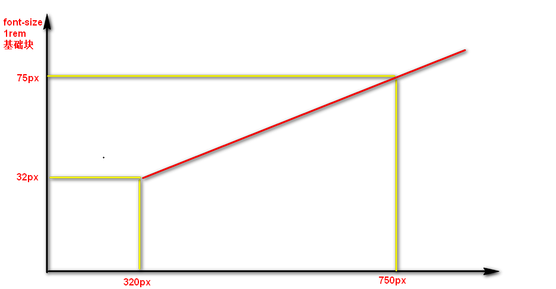

# 00-回顾

* **圣杯布局：**
  * box-sizing:border-box;
  * flex布局
  * 不设置宽度，左右margin向内挤；
* **flex布局：在侧轴上拉伸的原因**
  * 子元素默认align-self：auto;
  * 当父亲没有设置align-items时，auto取值为拉伸；
* **flex布局：最为重要的三个属性**
  * 确认主轴: flex-direction
  * 侧轴对齐: align-items:center
  * 划分份数：flex:1


# 01-rem布局-rem单位

* 语法：rem:root指HTML的font-size大小
* 特点：绝对唯一控制，接近等比变化的第一步；只要你把PX单位换成rem单位；


# 02-rem布局-媒体查询-语法

* 语法：查询屏幕，响应屏幕变化；

```css
    /* 查询：屏幕 当宽度是600px */
    /* 写我们平时写的CSS代码 */
    /* @media screen and (width:600px) {
      body {
        background-color: red;
      }
    } */
    /* 当屏幕最小界值是600px ,>=600px */
    /* @media screen and (min-width:600px) {
      body {
        background-color: red;
      }
    } */
    /* 宽度最大值 600px ,宽度<=500px*/
    /* @media screen and (max-width:500px) {
      body {
        background-color: red;
      }
    } */
```


# 02-rem布局-媒体查询-档位划分

* 语法：

```css
    /* 档位划分：习惯用min-width */
    
    @media screen and (min-width:0px) {
      body {
        background-color: red;
      }
    }

    @media screen and (min-width:540px) {
      body {
        background-color: blue;
      }
    }
    /* - 档位3 : 640px<=w */
    
    @media screen and (min-width:640px) {
      body {
        background-color: green;
      }
    }
```


# 03-rem布局-rem&媒体查询

* 核心等比语法：

```css
    /* 档位划分：媒体查询，里面设置 要变化的内容 */
    /* 里面设置：语法上设置HTML字体大小 其实设置rem单位背后的值 */
    
    @media screen and (min-width:0) {
      html {
        font-size: 16px;
      }
    }
    
    @media screen and (min-width:540px) {
      html {
        font-size: 20px;
      }
    }
    
    @media screen and (min-width:700px) {
      html {
        font-size: 30px;
      }
    }
```

* 等比：计算出来的rem前面的那个比例，**这个比例在各个档位下，一直不变；**
* 变的是谁？rem背后的那个值；


# 04-rem布局-less-安装

# 05-rem布局-less-语法

* 语法：高效写less

```

// 在less 写CSS
// div {
//   width: 100px;
//   height: 100px;
// }

// a {
//   font-size: 20px;
// }


// 变量
@color:#222;

header {
  background-color: @color;
}

.box_1 {
  color: @color;
}

.box_2 {
  border:2px solid @color;
}


// 嵌套 更好管理你的代码，更符合逻辑上思考
.box {
  width: 100px;
  background-color: @color;
  .son {
    width: 100%;
    height: 50px;
    a {
      background-color: red;
      // &:hover {
      //   background-color: #222;
      // }
      // &::before {
      //   content:"";
      // }
    }
    a::before {
      content:"1";
    }

  }
}


// 运算
div {
  width: 268/16rem;
  width: 50+50px;
  height: 50-17px;

  //单位：不参与运算，
  // 选择： 两个不同的单位，取第一个单位；
  height: 50rem/16px;
  // 
  background-color: #666-#222;
}


// 要求：不是大纲 
// 工作中：不是直接写CSS 习惯写less; 
```


# 06-rem布局-rem&媒体查询&less方案

* 档位：按照市场上所有手机尺寸形成各个档位的最小界值；
* rem背后的值：按照各个档位除以 相同份数；

```less
@fenshu:10;

// 320~360

@media screen and (min-width: 320px) {
  html {
    font-size: 320px/@fenshu;
  }
}
// 360~375
@media screen and (min-width: 360px) {
  html {
    font-size: 360px/@fenshu;
  }
}
// 375 iphone 678
@media screen and (min-width: 375px) {
  html {
    font-size: 375px/@fenshu;
  }
}
// 384
@media screen and (min-width: 384px) {
  html {
    font-size: 384px/@fenshu;
  }
}
// 400
@media screen and (min-width: 400px) {
  html {
    font-size: 400px/@fenshu;
  }
}
// 414
@media screen and (min-width: 414px) {
  html {
    font-size: 414px/@fenshu;
  }
  
}
// 424
@media screen and (min-width: 424px) {
  html {
    font-size: 424px/@fenshu;
  }
}
// 480
@media screen and (min-width: 480px) {
  html {
    font-size: 480px/@fenshu;
  }
}
// 540
@media screen and (min-width: 540px) {
  html {
    font-size: 540px/@fenshu;
  }
}
// 720
@media screen and (min-width: 720px) {
  html {
    font-size: 720px/@fenshu;
  }
}
// 750
@media screen and (min-width: 750px) {
  html {
    font-size: 750px/@fenshu;
  }
}
```


# 07-rem布局-方案1-构建文件目录及初始化


# 08-rem布局-方案1-顶部栏

# 09-rem布局-方案1-轮播图和广告

# 10-rem布局-方案1-导航


# 11-rem布局-方案1-rem替换

* 第二步：用rem替换px
  * **准备各个档位下的rem**：提前准备好各个档位下的HTML 的font-size大小；
  * **拿到当前设计稿屏幕尺寸对应的rem背后的值**：
    - 因为我现在是750px的设计稿，
    - 可以得到750px这个尺寸属于的档位下的  HTML 的font-size大小，
    - 也就是750px设计稿下的1rem值背后的代表的值是多少。
  * **计算比例**：把页面刚才所有的元素的PX值替换为 rem 比例值；（82px  82rem/75= 1.785rem ）;
  * **达到目标**：那么，屏变化时，1rem也会变化，自然就是等比缩放；


# 12-rem布局-方案1-小结

# 13-rem布局-rem&flexible.js方案

* 方案1：阶梯型变化，档位划分的不够细；
* 想要：1px划分一个档位；不现实（320~750）；
* flexible.js：
  * 默认划分10份
  * 变化一点就算一次，足够细程度；


# 14-rem布局-方案2-介绍及操作

# 15-rem布局-方案2-构建文件目录&初始化&页面实现

* 第一步骤：原稿实现


# 16-rem布局-方案2-rem替换

# 17-rem布局-方案2-小结

* 通过JS控制 1rem 背后代表多少；
* 连续变化特点，**推荐**




# 18-rem布局-方案对比及总结

* 流式布局：百分比布局，控制宽度，浮动（清除浮动）
* **flex布局：移动端；推荐方案；**
  * 确认主轴
  * 侧轴对齐：居中
  * flex：
    * 1
    * 20% （一定要加起来是100%）

* rem布局：rem+flexible.js 连续变化；用户友好体验；
  * 第二步：
    - **准备各个档位下的rem**：这个不需要准备，JS帮我们实现每个屏幕都有自己的font-size
    - **拿到当前设计稿下的1rem代表多少PX值**：因为我现在是750px的设计稿，所以可以得到750px这个尺寸属于的档位下的HTML 的font-size大小，也就是750px设计稿下的1rem值。
    - **计算比例**：把页面刚才所有的元素的PX值替换为 rem 比例值；（82px 想转换成多少rem ,75px = 1rem  82rem/75）;
    - **达到目标**：那么，屏变化时，1rem(基础块)也会变化，自然就是等比缩放；


