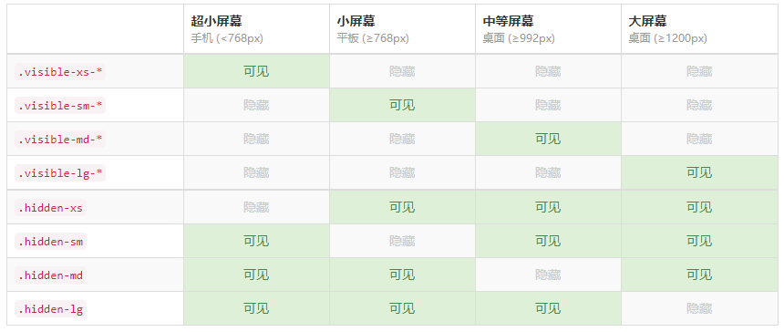

# 00-回顾

* **rem+flexible.js+less**
  * 第一步：原稿实现 flex 布局；
  * 第二步：**将PX单位换为rem单位；**
    * 1.引入JS文件，看HTML标签的行内属性style是否有font-size，默认划分为10份；
    * 2.看当前设计稿多大，如果UI当前设计稿是640px,那么对于当前设计稿的1rem = 640px/10 = 64px;
    * 3.把原稿实现所有使用PX单位的属性，全部替换为rem单位；试着拉伸屏幕，等比变化；
      * @base:64;
      * 82rem/@base
    * 4.JS是设置font-size从0到无限大，都是划分10份；但是JS不知道小于320  和 大于750px 就应该不变化，**我们需要手动设置这两个范围的媒体查询；CSS文件：没有行内权重高，提权**


# 01-响应布局-介绍及版心设置

* 语法：约定：档位划分，版心设置；

```css
    /* 1  xs */
    
    @media screen and (min-width:0) {
      .container {
        width: 100%;
      }
    }
    /* 2 s */
    
    @media screen and (min-width:768px) {
      .container {
        width: 750px;
      }
    }
    /* 3. m */
    
    @media screen and (min-width:992px) {
      .container {
        width: 970px;
      }
    }
    /* 4. L */
    
    @media screen and (min-width:1200px) {
      .container {
        width: 1170px;
      }
    }
    /* 5.  第五档位 */
    /* @media screen and (min-width:1280px) {} */
    
    .container {
      height: 300px;
      background-color: #ccc;
      margin: 0 auto;
    }
```


# 02-响应布局-布局

* 语法：
  * 布局能随时改变HTML结构下的布局不同，
  * 原因就是因为我提前已经写好了这些类；
  * **我叫这些提前写好的类名：预制类**

```css
    @media screen and (min-width:992px) {
      .container {
        width: 970px;
      }
      .md-1 {
        width: 10%;
      }
      .md-2 {
        width: 20%;
      }
      .md-3 {
        width: 30%;
      }
      .md-4 {
        width: 40%;
      }
      .md-6 {
        width: 60%;
      }
      .md-5 {
        width: 50%;
      }
      .md-7 {
        width: 70%;
      }
      .md-8 {
        width: 80%;
      }
      .md-9 {
        width: 90%;
      }
      .md-10 {
        width: 100%;
      }
    }
```


# 03-bootstrap-介绍及初始化

* 初始化

```html
<!DOCTYPE html>
<html lang="zh-CN">
  <head>
    <meta charset="utf-8">
    <!-- 要求 当前网页 使用 IE浏览器 最高版本的内核 来渲染 -->
    <meta http-equiv="X-UA-Compatible" content="IE=edge">
    
    <!-- 视口的设置：视口的宽度和设备一致，默认的缩放比例和PC端一致，用户不能自行缩放 -->
    <meta name="viewport" content="width=device-width, initial-scale=1">
      
    <title>Bootstrap Template</title>

    <!-- Bootstrap 的文件引入 已经有初始化文件 Normalize.css-->
    <link href="css/bootstrap.min.css" rel="stylesheet">
      
   
    <!--解决ie9以下浏览器对 html5新增标签的不识别，并导致CSS不起作用的问题-->
    <!--解决ie9以下浏览器对 css3 Media Query  的不识别 -->
     
    <!-- 条件注释:小于IE9的版本 -->
    <!--[if lt IE 9]>
      <script src="//cdn.bootcss.com/html5shiv/3.7.2/html5shiv.min.js"></script>
      <script src="//cdn.bootcss.com/respond.js/1.4.2/respond.min.js"></script>
    <![endif]-->
  </head>
  <body>
    <h1>你好，世界！</h1>
  </body>
</html>
```


# 04-bootstrap-容器及预制类

* 版心：和市场默认一样的；
* 预制类：修改，重新起个类名；


# 05-bootstrap-栅格-介绍及基本使用

* 栅格系统：
  * 作用列分配布局
  * 分成12份；
  * 提前写好了这些列的分配的类名；
* 特点：
  * 容器：有左右15padding
  * 盒子col-lg-：有左右15padding
  * 去除15padding：加div.row(左右-15pxmargin值，向外撑)
  * 所有元素：CSS3盒子模型；

# 06-bootstrap-栅格-列相关使用

* 语法：偏移：左右分布，居中分布；

```html
    <div class="row">
      <div class="col-md-4 col-lg-6 son">
      	<!-- 如果要去除父亲的15pxpadding，加row -->
        <div class="row">
          <div class="col-lg-4 son">1</div>
          <div class="col-lg-8 son">2</div>
        </div>
      </div>
      <div class="col-md-8 col-lg-6 son">b</div>
    </div>


    <div class="row">
      <div class="col-lg-4 son">1</div>
      <div class="col-lg-4 col-lg-offset-4 son">2</div>
    </div>

    <div class="row">
      <div class="col-lg-8 col-lg-offset-2 son">1</div>
    </div>
```


# 07-bootstrap-响应式工具

* 预制类：




# 08-案例-初始化


# 09-案例-实现思路

* **向上：选择列的分配，根据UI给我的图，观测某个档位以上的布局都是一样的，那个这个档位就是我选择列分配入口；**


# 10-案例-左侧导航

# 11-案例-中部-图片区

# 12-案例-中部-新闻列表


# 13-案例-右侧板块


# 14-案例-媒体查询-左侧导航

* **向下：涉及到向下布局是一样的，手动写一个媒体查询；**


# 15-案例-媒体查询-中部-图片区

# 16-案例-媒体查询-中部-新闻列表

* **涉及到：显示或隐藏，用响应式工具；**


# 17-整理

- 基础班：
  - pc布局：定位、margin、padding、border、浮动（清除浮动）；
- 单独制作移动端布局三种方案
  - 流式布局：百分比，**百分数控制宽度**，浮动（清除浮动）；
  - **flex**：行和列看待元素，
    - 不要再想块级、行内；
    - **控制宽度、布局快；**【！！！】
    - 重点属性
      - 确认主轴方向
      - 侧轴对齐:center;
      - flex子元素份数：
        - 份数  
        - %(必须加起来是100%)
  - rem：可以控制高度，**等比变化；**rem+flexible.js+less【！！！】
    - 变化：媒体查询、**手机端的所有屏幕划分档位；<=750px**
    - 方案：
      - rem+媒体查询+less：阶梯型变化，不同档位约定：每个档位最小值 / 约定份数；档位范围内，rem一直是不变，整体不变；
      - **rem+flexible.js+less【！！！】：通过JS控制rem，不需要档位；连续变化，（推荐原因）**
    - **案例：实际开发过程步骤**
      - 第一步：按照UI给的设计稿，原稿实现；推荐flex布局，以后写CSS用less；
      - 第二步：
        - 选方案，定下来当前这个设计稿的1rem是多大；
        - 替换：计算等比的那个比例；
- 响应式布局：**适配三端；**PC、平板、手机适配
  - 档位划分：全部屏幕划分，版心设置；0~1200~~
  - BS框架：
    - 拿来即用，注意修改重新设置类；
    - **案例分析步骤：实际开发**
      - 列的分配向上：UI给一堆设计稿；
        - 场景：新闻列表、整体布局；
        - 注意：涉及到**列的分配，**要观测UI给我的图，观测某个节点以上的布局都是一样，就哪个档位入手；
      - 往下变化：小屏、超小；
        - 观测这些设计稿从哪个节点**往下**，有不同的布局，手动写**媒体查询**


- **你应该怎么面对：**
  - PC：PC基础班
  - 单独移动端：
    - 等比：rem+flexible.js
    - 不用等比：flex;
  - 响应式页面：UI给你多个端的图，做个页面，适配所有屏幕：响应式布局；


# vertical-align 属性

<http://www.w3school.com.cn/css/pr_pos_vertical-align.asp>


