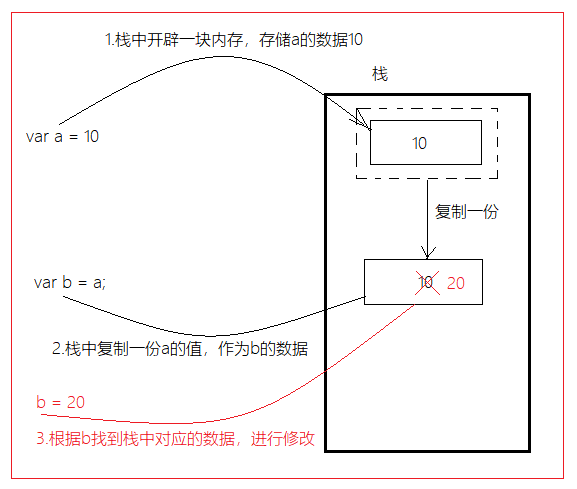

# 00-反馈

* 函数封装基本不懂
  * 执行函数
* 对预解析的过程有点蒙，怎么区别用全局作用域和局部作用域？

```js
  // 遇见 变量的声明，函数的声明，都会把刚才这些声明提升到 当前的作用域顶部；
  console.log(a, '外面');


  // 声明；
  var a = 1;

  demo();

  function demo() {
    console.log(a, '里面');
    var a = 2;
  }


  // 如果：局部声明一些变量，要提升到当前局部作用域的对顶端；
  // function demo() {
  //   var a;
  //   打印的a:是你局部的a变量；
  //   console.log(a, '里面');
  //   a = 2;
  // }

  // 当前函数内部没有任何声明，不需要提升到你当前的作用域；
  // 执行函数体：
  // 遇见a：全局作用域的a,原因就是因为作用域是全局的，全局：在写的脚本内部，任何地方，包括你函数的内部；
  // function demo() {
  //   console.log(a, '里面');
  //   a = 2;
  // }
```


# 01-对象-介绍及声明

* 对象思想：万物皆对象；
* 对象：属性和方法集合体；
* 声明方式：

```js
  // 创建对象
  // 1.构造函数
  // JS 内置构造函数；Object
  var obj = new Object();
  // 
  // var date = new Date();

  // 2.字面量的方式声明一个对象；
  var obj_1 = {};
```


# 02-对象-添加属性

* 对象：是属性和方法的集合体；

```js
  // 1.声明对象
  var obj = {};


  // 2.添加属性（特征）
  // 语法：对象.属性的名称 = 属性值（特征的值）
  // 属性的名称：根据你的业务需求自己命名的；
  obj.name = "狗蛋";


  // 3.添加方法：
  // 语法 对象.方法名 = 函数(匿名函数)
  // 函数什么时候才会执行？调用的时候才会执行；
  obj.say_name = function() {
    console.log(obj.name);
  }
```

# 02-对象-添加属性的其他方式

```js
  // 如果一开始，你知道对象内部的属性和方法，初始化声明
  var obj = {
    // 语法：属性名:属性值
    // 多个属性名和值之间用, 隔开；
    name: "狗蛋",
    // 
    age: 12,
    // 方法名:函数
    sayName: function() {
      console.log(obj.name);
    }
  };


  // 声明方式：键值对的方式声明；
  // 语法：对象["属性名"]  = 属性值；

  var obj = {};

  obj["name"] = "狗蛋";
  obj["age"] = 45;
```


# 03-对象-获取及遍历属性

* 获取：

```js
  // 获取：点的方式；
  // console.log(obj.name);
  // 键的方式
  // console.log(obj["name"], obj.age);


  // 添加属性和获取属性的语法方式不同，不是说哪个方式的添加就必须用哪个方式的获取；
```

* 补充：打印一个对象上没有的属性名，返回值undefined；

* 遍历：

```js
  // 遍历：数组遍历（循环）
  // 遍历：对象遍历（对象上这些方法一个个过一次，也是某种意义上的循环）
  // key：泛指 代表 对象上的每对键值对的 键；
  for (var key in obj) {
    // console.log(key);

    // 获取方式：
    // 点方式：obj.key 为什么会输出 undefined；
    // 把obj.key 这个key 当做一个属性名；
    // console.log(obj.key);

    // ["属性名"]
    // console.log(obj[key]);

    console.log(key, obj[key]);

  }
```


# 04-小娜v3-对象化

* 先面向逻辑过程，把代码写出来；
* 抽象为一个函数；
* 给一个对象，添加方法；


# 05-对象-拓展Math的n-m的随机整数

* 语法：
  * 1.实现具体过程；
  * 2.抽象为函数
  * 3.给Math添加一个方法；

```js
  // 3.拓展Math新的方法
  Math.getRandom = function(n, m) {
    var res = Math.random() * (m - n + 1);
    // 向下取整 [0,m-n]
    res = Math.floor(res);


    // res [0,40];  加10之前；
    res = res + n;

    // res [10,50];
    // console.log(res);
    // 
    return res;
  }
```


# 06-小娜v3-拓展-添加笑话功能-01-基础知识


# 06-小娜v3-拓展-添加笑话功能-02-实现


# 07-js-简单类型与复杂类型

* 简单类型：



- **复杂类型：修改的是同一个堆内存地址上的数据，所以obj1和obj2修改的其实是同一个对象**

