# 1. Node概述

## 1.1 Node介绍

<!--1.1-概述-Nodejs介绍-->

- Node全名是Node.js，但它不是一个js文件，而是一个软件

- ==Nodejs是一个==基于Chrome V8引擎的==ECMAScript的运行环境==
- Nodejs可以执行js代码，这一点和浏览器一样
- ==Nodejs提供了大量的工具==（API），能够让我们==完成文件读写、Web服务器创建等==功能

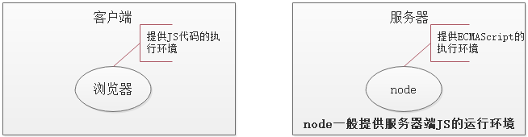

## 1.2 node.js中的JS和浏览器中的JS的区别

- 安装了浏览器这个软件，它不但可以执行ECMAScript，浏览器这个软件内置了window对象，所以浏览器有处理DOM和BOM的能力。
- 安装了Node.Js这个软件，它不但可以执行ECMAScript，NodeJS这个软件也内置了一些东西，包括全局成员和模块系统。

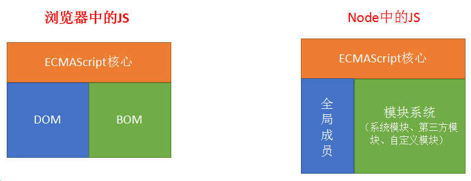

## 1.3 为什么要学习Nodejs

在我们熟悉的浏览器上执行JS不是很好吗？为什么还要安装Nodejs，要学习Nodejs呢？主要原因：

- 大前端必备技能
- 使得JS能够和操作系统 “互动”（读写、创建文件等，还可以处理计算机中的进程。）
- 为JavaScript提供了服务端编程的能力
    - 文件IO
    - 网络IO
- 了解服务器这个黑盒内部的实现原理
- 了解接口开发
- 进一步理解Web开发

## 1.4 安装Nodejs

<!--1.4-安装-安装Nodejs-->

官网： https://Nodejs.org/en/

中文网：http://Nodejs.cn/

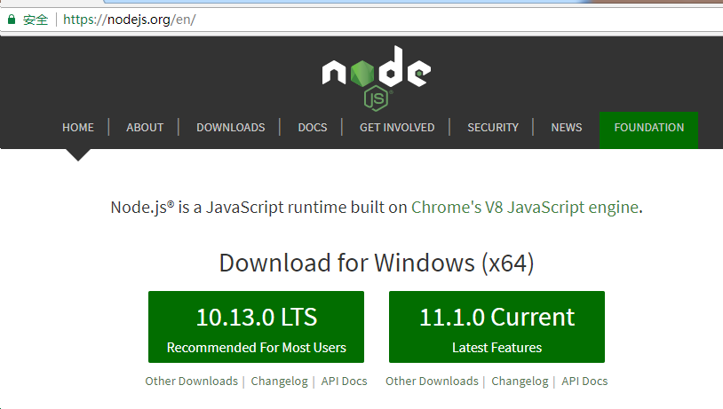

- 版本说明
    - **LTS**： 长期稳定版。 实际项目开发建议使用长期稳定版
    - **Current**： 最新版。最新版包含了一些新功能，如果想学习最新的功能，则可以使用该版本。但是，最新版可能会有一些未知的bug
- 安装
    - 到底选择哪个文件文件
        - node-v10.16.0.pkg  --  苹果系统
        - node-v10.16.0-x86.msi    --  windows32位系统  （右键我的电脑-->属性，可以查看电脑是32位）
        - node-v10.16.0-x64.msi    --  windows64位系统

1) 双击安装文件开始安装（不同系统选择对应的安装文件）

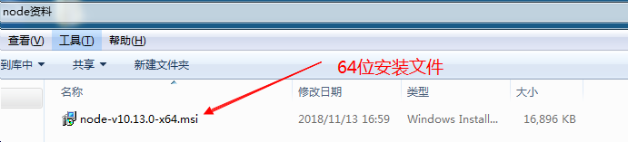


2) 傻瓜式安装，一路 'next' 即可

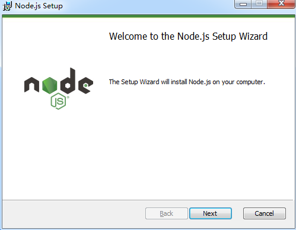

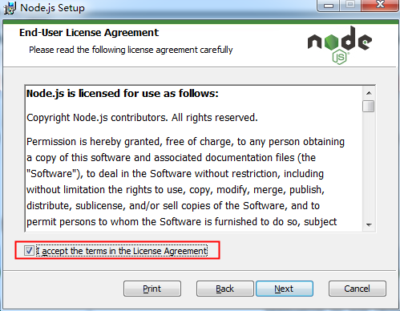


注意： **==安装在英文路径下==**； 


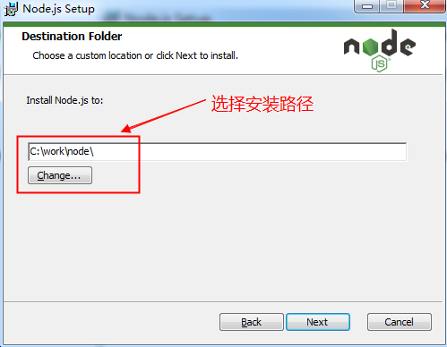


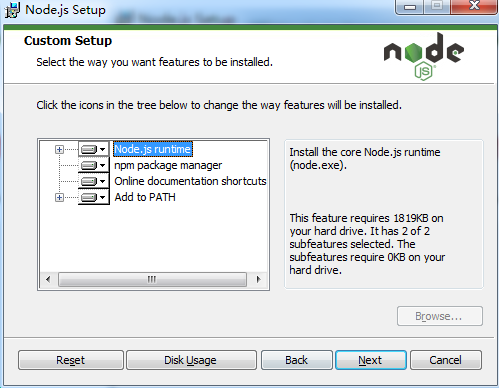

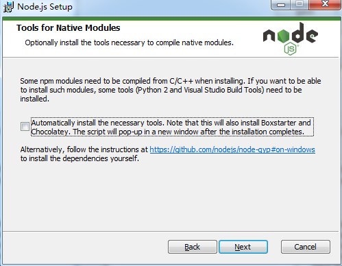

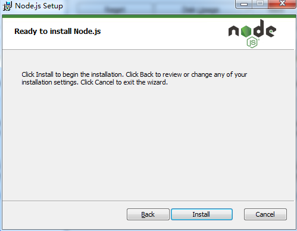

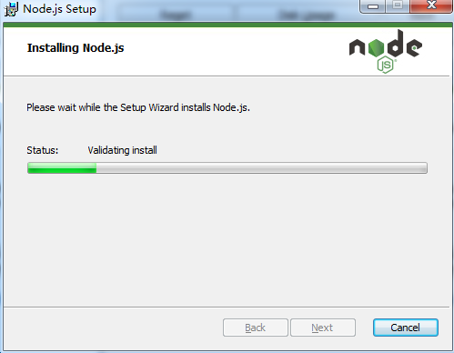


3) 测试

在桌面上或者是任意一个文件夹，按住 shift 键 , 点击鼠标右键，选择 '在此处打开命令窗口'


进入黑窗口后输入： `node -v`或`node --version`

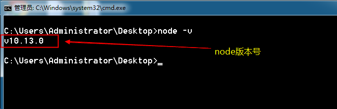


能够看到Nodejs版本号即为安装成功。

## 1.5 node初体验

<!--1.5-体验-在Node环境中执行JS代码和JS文件-->

### 1.5.1 使用node执行js代码

既然说node安装后，也可以执行JS，那么我们就用node执行一行js代码试试，或者写一个js文件，让node执行一下。

如下图所示，输入node命令-->回车，这样就进入到了node环境中了，这一步类似于之前打开浏览器的Console面板。

进入node环境后，就可以执行js代码了。

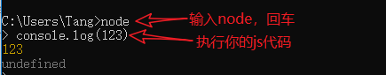

如果后面没有js代码要执行了，可以退出node环境，退出需要按住 `Ctrl` 键，按两次 `C` 键即可。

### 1.5.2 使用node执行一个js文件

进入node环境执行js代码，适合少量的代码，或者测试使用。

更多的情况，我们会将js代码写到js文件中，然后使用node命令执行js文件即可。

需要注意的是，要找好js文件的路径。


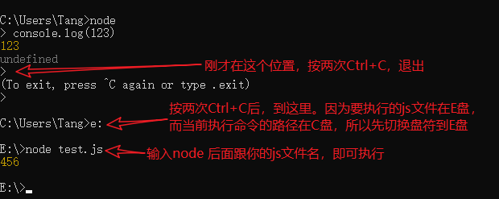

注意事项：

- 输入node回车后，要按两次Ctrl+C，才能回到目录中（Ctrl一直按着不放也可以，松开从新按也可以）
- 执行js文件时，如果当前命令行目录和js文件**不在**同一个盘符下，要先切换盘符
- 执行js文件时，如果当前命令行目录和js文件**在**同一个盘符中，则可以使用相对路径找到js文件并执行
- 体会，此时执行的js代码或文件和浏览器没有任何关系，他们是通过node执行的

# 2. Node学习

## 2.1 前言

<!--2.1-基础-Node知识网介绍-->

前面介绍了node也提供了一种JS的执行环境，确切的说是ECMAScript的执行环境。

node不但可以执行我们学习过的ECMAScript，node还自带了很多全局对象和很多模块。

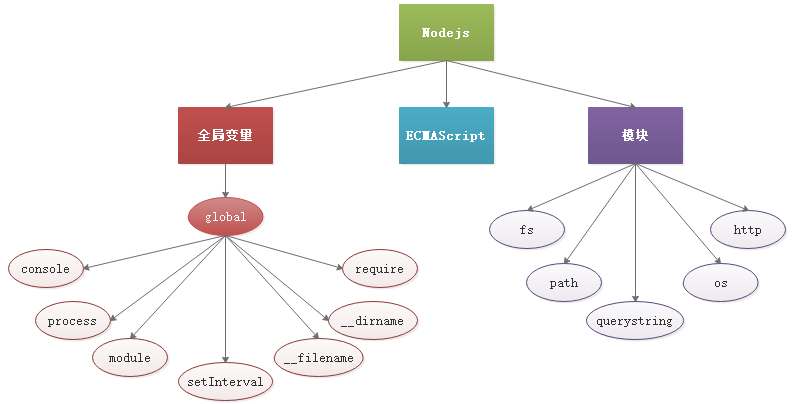

## 2.2 全局变量

<!--2.2-基础-Node中的全局变量-->

说明：

- node中有一个全局变量global，是node中最大的一个对象，相当于浏览器中的window对象。

- global中的成员在使用时，可以省略global，这点也类似浏览器中的window

下面介绍几个全局对象global中的成员：

- console，我们在初体验时，使用了console，它可不是浏览器中的console对象，使用的是node中的console
- process，和进程相关的对象
- setInterval，同理，也是node中的，不是浏览器中的
- **require()**，它是全局对象global中的一个方法，用于在js文件中引入另外的文件
    - require() 方法可以在js文件中加载另外的js文件（模块）
    - require() 方法可以在js文件中加载json文件
- __dirname，当前执行文件的绝对路径（在js文件中使用）
- __filename，当前执行文件的绝对路径，包含文件名（在js文件中使用）

> 上述：__dirname、\_\_filename、exports、module、require 这5个不能通过global调用，但是可以直接使用

上述成员使用下面的代码进行演示：

01-global的成员简介.js

```js
// Node中最大的全局对象是 global
// 调用global中的成员的时候，可以省略global

// global.console.log('hello');

// 省略了global的写法
// console.log('world');

// console.log(__dirname); // 一个当前正在执行的js文件的绝对路径（不包含文件夹）
// console.log(__filename);  // 一个当前正在执行的js文件的绝对路径（包含文件名）
```

test.js

```js
// Node中封装的console。
console.log(123);

for (let i = 0; i < 3; i++) {
    console.log(i);
}

// Node中封装的
setTimeout(() => {
    console.log('时间到了');
}, 2000);

```


## 2.3 node核心模块

> 模块是Node.js 平台自带的一套基本的 API(功能模块)。

### 2.3.1 path模块

<!--2.3.1-基础-path模块-->

> 处理路径的模块

- http://nodejs.cn/api/path.html
- 操作文件的时候经常要对文件的路径做处理，或者获取文件的后缀，使用 `path` 模块。
- `path` 是 Node 本身提供的 API，专门用来处理路径。
- `path` 仅仅用来处理路径的字符串，不一定存在对应的物理文件。

------

- 使用方法

    - 加载模块

        ```js
        // 使用核心模块之前，首先加载核心模块
        let path = require('path');
        // 或者
        const path = require('path');
        ```

    - 调用path模块中的方法，来处理相应的问题，下面列举path模块中的几个方法

        | 方法                       | 作用                             |
        | -------------------------- | -------------------------------- |
        | path.basename(path[, ext]) | 返回 path 的最后一部分(文件名)   |
        | path.dirname(path)         | 返回目录名                       |
        | path.==extname==(path)     | 返回路径中文件的扩展名(包含.)    |
        | path.format(pathObject)    | 将一个对象格式化为一个路径字符串 |
        | path.==join==([...paths])  | 拼接路径                         |
        | path.parse(path)           | 把路径字符串解析成对象的格式     |
        | path.resolve([...paths])   | 基于当前**工作目录**拼接路径     |

        > 工作目录：当前运行 Node 程序的目录

        ```js
        const path = require('path');
        
        // extname -- 获取文件后缀
        console.log(path.extname('index.html')); // .html
        console.log(path.extname('index.coffee.md')); // .md
        
        // join -- 智能拼接路径
        console.log(path.join('/a', 'b', 'c')); // \a\b\c
        console.log(path.join('a', 'b', 'c')); // a\b\c
        console.log(path.join('/a', '/b/../c')); // \a\c
        console.log(path.join('/a', 'b', 'index.html')); // \a\b\index.html
        console.log(path.join(__dirname, 'a', 'index.html')); // 得到一个绝对路径
        ```

        

### 2.3.2 fs模块

<!--2.3.2-基础-fs模块-->

> 文件操作模块

- http://nodejs.cn/api/fs.html
- 文件系统，对文件/文件夹的操作  file system

------

- 使用方法

    - 加载模块

        ```js
        // 引入模块，引入模块的时候，可以使用var、let，但是建议使用const，因为我们不希望它改变
        const fs = require('fs');
        ```

    - 调用fs模块的方法，下面列举fs模块中的常用方法

        | API                                         | 作用              | 备注           |
        | ------------------------------------------- | ----------------- | -------------- |
        | fs.access(path, callback)                   | 判断路径是否存在  |                |
        | fs.appendFile(file, data, callback)         | 向文件中追加内容  |                |
        | fs.copyFile(src, callback)                  | 复制文件          |                |
        | fs.mkdir(path, callback)                    | 创建目录          |                |
        | fs.readDir(path, callback)                  | 读取目录列表      |                |
        | fs.rename(oldPath, newPath, callback)       | 重命名文件/目录   |                |
        | fs.rmdir(path, callback)                    | 删除目录          | 只能删除空目录 |
        | fs.stat(path, callback)                     | 获取文件/目录信息 |                |
        | fs.unlink(path, callback)                   | 删除文件          |                |
        | fs.watch(filename[, options]\[, listener])  | 监视文件/目录     |                |
        | fs.watchFile(filename[, options], listener) | 监视文件          |                |

        ```js
        // 使用Node中的模块（内置对象），必须先加载这个对象
        const fs = require('fs');
        // console.log(fs);
        
        
        // 功能：判断文件或路径是否存在
        // fs.access(需要判断的路径, 检测路径是否存在的一个回调函数);
        fs.access('E:/Study/83/Node-02/Node代码/test.json', (err) => {
            // console.log(err);
            // err 为 null，表示没有错误；意思是表示判断的文件 存在
            // err 为 错误对象，意思判断的文件 不存在
            if (err) {
                console.log('文件不存在');
            } else {
                console.log('文件存在');
            }
        });
        ```

        

        ```js
        // readFile -- 异步读取文件
        fs.readFile('./test.json', (err, data) => {
            if (err) {
                console.log('读取文件出错');
            } else {
                console.log(data); // 读取到的二进制数据
                console.log(data.toString()); // 得到原始数据
            }
        });
        
        fs.readFile('./test.json', 'utf-8', (err, data) => {
            if (err) {
                console.log('读取文件出错');
            } else {
                console.log(data); // 读取到的原始数据
            }
        });
        ```

        ```js
        // writeFile -- 异步写入文件
        fs.writeFile('./abc.html', 'hello world', (err) => {
            if (err) {
                console.log('写入文件失败');
            } else {
                console.log('文件写入成功');
            }
        });
        ```

        

### 2.3.3 querystring模块

<!--2.3.3-基础-querystring模块-->

> 查询字符串（id=1&name=zs&age=20）处理模块

- 处理查询字符串（请求参数）的模块

------

- 使用方法

    - 加载模块

        ```js
        const querystring = require('querystring');
        ```

    - 调用querystring模块中的方法

        ```js
        // parse -- 将查询字符串解析成JS对象
        console.log(querystring.parse('id=1&name=zs&age=20')); 
        // { id: '1', name: 'zs', age: '20' }
        
        // stringify -- 将JS对象转成查询字符串
        console.log(querystring.stringify({ id: '1', name: 'zs', age: '20' }));
        // id=1&name=zs&age=20
        ```

### 2.3.4 url模块

<!--2.3.4-基础-url模块-->

> url模块
>
> 一个完整的url  协议://主机地址:[端口]/文件地址?参数

- 提供两套处理url的API
- 遗留的API（node封装的一套API），提供url.parse();方法解析url
- 新的API（ECMAScript新增对象URL），通过实例化URL，来解析url

------

- 使用方法

    - 加载模块

        ```js
        const url = require('url');
        ```

    - 遗留API使用方法

        ```js
        let myURL = url.parse('/test.html?id=11&age=22'); // 返回一个包含url各个部分的对象
        ```

    - 新的API使用方法，实例化的时候，必须传递一个**完整的**url

        ```js
        // 直接提供一个完整的url
        let myURL = new URL('http://www.xxx.com/test.html?id=11&age=22');
        // 或
        // 提供两个参数，一是文件路径及参数部分，二是域名，总之，二者组合必须是完整的url
        let myURL = new URL('/test.html?id=11&age=22', 'http://www.xxx.com');
        
        // 得到的myURL是一个对象，包含url中的各个部分
        // 如果需要解析参数部分，则使用querystring模块，或使用URL的一个子对象searchParams中的get方法
        let age = myURL.searchParams.get('age')； // 22
        ```

## 2.4 http模块

> http服务器处理模块，可以使用http模块搭建服务器
>
> node不同于Apache，安装完node并没有一个能够提供Web服务环境，需要使用http模块自己来搭建Web服务器

- http是一个系统模块，让我们能够通过简单的流程创建一个Web服务器

------

### 2.4.1 使用http模块搭建Web服务器

<!--2.4.1-基础-使用http模块搭建Web服务器-->

- 使用http模块搭建Web服务器

    创建 Web 服务器的步骤

    - 导入 http 核心模块
    - 创建 server 对象(server 对象负责建立连接，接收数据)
    - 注册 request 事件，当浏览器发送请求到服务器执行，设置处理请求的函数
    - 监听端口（==这个步骤也可以放到注册request事件之前==）

    ```js
    // 1. 加载http模块
    const http = require('http');
    
    // 2. 创建服务对象，一般命名为server
    const server = http.createServer(); // create创建、server服务器
    
    // 3. 给server对象注册请求（request）事件，监听浏览器的请求。只要有浏览器的请求，就会触发该事件
    server.on('request', () => {
        // 只要有浏览器的请求，就会触发该事件
        console.log('我发现你的请求了，但是不想搭理你');
    });
    
    // 4. 设置端口，开启服务
    server.listen(3000, () => {
        console.log('服务器启动了');
    });
    ```

    - 当服务器接收到浏览器的请求后，如果没有做出响应，浏览器会等待
    - 服务器的最终目的是要根据请求做出响应

### 2.4.2 如何对浏览器的请求做出响应

<!--2.4.2-基础-对浏览器的请求做出响应-->

> 当收到浏览器的请求后，会触发request事件，其实就是触发request事件的处理函数（该函数有两个核心参数 request 和 response）

请求已经能够收到了，现在急需给浏览器的请求做出响应，这里就使用到了处理请求的函数，具体的是使用到了该函数的第二个参数，见下面的代码。

```js
// 代码片段
server.on('request', function (req, res) {
  // 该函数就是处理请求响应的函数
  // 形参res是响应response的简写
})
```

- [形参res](http://nodejs.cn/api/http.html#http_class_http_serverresponse)
    - 形参res是response的缩写
    - 响应对象，服务器给浏览器返回的响应内容，可以通过该对象设置
    - res.write()  设置响应体（返回给浏览器的内容）的内容，可以多次调用，但是只调用write不会做出响应，发送响应要调用 end() 
    - res.end()    把响应报文（响应行、响应头、响应体）发送给浏览器
    - res.setHeader()  设置响应头，比如设置响应体的编码
    - statusCode 设置状态码
    - writeHead(200, {响应头})

PS：浏览器在请求服务器的时候，默认会请求网站根目录下的 `/favicon.ico` 网站图标

- 响应代码

    - 响应一句话

    ```js
    // 1. 加载http模块
    const http = require('http');
    
    // 2. 创建server对象
    const server = http.createServer();
    
    // 3. 监听端口，开启服务
    server.listen(3000, () => console.log('server start'));
    
    // 4. 监听浏览器的请求。只要有浏览器的请求，就会触发下面的事件
    server.on('request', (req, res) => {
        // req：request，请求；它是一个对象；它包含了所有和请求相关的信息
        // res：response，响应；它是一个对象；它包含了所有和响应相关的信息
        /**
         * res.end('响应的内容'); --- 它可以设置响应体，并做出响应
         * res.setHeader(); --- 设置响应头
         * res.write('响应体'); -- 设置响应体，但不会做出响应
         * res.writeHead() -- 设置响应头，设置响应状态码
         * res.statusCode = 404;  ---- 设置响应状态码
         */
        // res.statusCode = 404;
        res.setHeader('Content-Type', 'text/html; charset=utf-8');
        res.end('hello，我是服务器');
    });
    ```

    - 响应一个html文件

    ```js
    
    // 如果需要将一个html页面返回给浏览器，则读取文件，然后返回即可
    const fs = require('fs');
    
    // 1. 加载http模块
    const http = require('http');
    
    // 2. 创建服务对象，一般叫做server
    const server = http.createServer();
    
    // 3. 监听端口，开启服务
    server.listen(3000, () => console.log('我又启动了'));
    
    // 4. 给server注册request事件。当有浏览器的请求，就会触发该事件
    server.on('request', (req, res) => {
        // 浏览器请求的是什么？
        /**
         * req.url ----  获取请求的url
         * req.method --- 获取请求的方式，值为GET或POST
         * req.headers -- 所有的请求头
         */
        console.log(req.url);
        // 判断，如果请求的是index.html。则相应index.html
        if (req.url === '/index.html') {
            // 使用fs.readFile读取index.html。读取的结果就是index.html里面的源代码
            // 最后将读取的结果响应即可
            fs.readFile('./manager/index.html', (err, data) => {
                if (err) throw err;
                res.end(data);
            });
        }
    });
    ```


### 2.4.3 根据不同 url 地址处理不同请求

<!--2.4.3-基础-根据请求url的不同做出不同的响应-->

前面已经可以对浏览器的请求做出响应了，但是响应的内容总是一样的。能不能根据url的不同，做出合适的响应呢？当然可以，那么首先就需要知道浏览器请求的url是什么。

涉及到和请求相关的信息，都是通过请求响应处理函数的第一个参数完成的。

```javascript
server.on('request', function (req, res) {  
  // 形参req 是 请求request的意思，所有和请求相关的信息，都在req对象中
})
```

- [形参req](http://nodejs.cn/api/http.html#http_class_http_incomingmessage)
    - 请求对象，浏览器发送的请求报文中的数据已经被解析到该对象上
    - **req.url**            获取请求行中的路径
    - **req.method**   获取请求行中的请求方法
    - req.headers    获取请求头

- 代码实例

    ```js
    const fs = require('fs');
    
    const http = require('http');
    const server = http.createServer();
    server.listen(3000, () => console.log('又又开启了'));
    
    server.on('request', (req, res) => {
        // console.log(req.method); // 获取请求方式 GET 或 POST
        // console.log(req.url); // 获取请求地址
        // console.log(req.headers); // 获取请求头的信息
    
        /* if (req.url === '/index.html') {
            // 说明浏览器请求的是 index.html 文件
            fs.readFile('./index.html', (err, data) => {
                if (err) throw err;
                res.end(data);
            });
        } else if (req.url === '/login.html') {
            // 说明浏览器请求的是 login.html 文件
            fs.readFile('./login.html', (err, data) => {
                if (err) throw err;
                res.end(data);
            });
        } */
    
        // 判断浏览器请求的文件是否存在，如果存在，则读取文件响应结果；如果不存在，则告知404
        fs.access('.' + req.url, (err) => {
            if (err) {
                // 说明文件不存在
                res.writeHead(404, {
                    'Content-Type': 'text/html; charset=utf-8'
                });
                res.end('小朋友，你走错了');
            } else {
                // 说明文件存在
                fs.readFile('.' + req.url, (err, data) => {
                    if (err) throw err;
                    res.end(data);
                });
            }
        });
    
    });
    ```


### 2.4.4 处理浏览器POST方式提交的数据

<!--2.4.4-基础-处理浏览器POST方式提交的数据-->

> 浏览器要发送POST方式的请求比较麻烦，所以这里可以使用POSTMAN软件来模拟请求。

上一节，我们根据不同的url地址，对不同的请求，做出了不同的响应。但这些请求都是GET方式的请求，如果浏览器使用POST方式向服务器发送了一次请求，又该如何处理呢？

POST请求一般会提交数据给服务器，服务器在接收数据的时候也是分块接收的

```js
const http = require('http');

const server = http.createServer();

server.listen(3000, () => console.log('我有回来了'));

// 有请求过来，就会触发这个事件。请求包含GET和POST两种请求
server.on('request', (req, res) => {
    // 当有数据提交给服务器之后。
    // 服务器接收提交过来的数据；并且保存（json文件中，或者数据库中）
    /**
     * 1. 创建一个空字符串，用于保存提交过来的数据
     * 2. 给req注册data事件，只要有数据提交过来，就会触发；用于接收提交过来的数据；数据比较大的话，是分块接收的
     * 3. 给req注册end事件，当完全接收了提交过来的数据，就会触发
     */
    let str = ''; // 定义一个用于保存数据的空字符串
    req.on('data', (chunk) => {
        // chunk -- 块
        str += chunk;
    });
    req.on('end', () => {
        console.log(str); // id=1&name=zs&age=43
    });
});
```

### 2.4.5 处理静态资源

<!--2.4.5-1-基础-处理静态资源-->

<!--2.4.5-2-基础-统一处理静态资源-->

- 静态资源指的是html文件中链接的外部资源，如css、js、image文件等等。

- 如果请求的a.html 文件中链接了外部文件(静态资源)，比如css、images、js文件等，浏览器会自动再次发送请求，向服务器请求这些文件
- 服务器要判断浏览器请求的路径是否是静态资源，如果是静态资源把静态资源的内容返回给浏览器

------

我们之前和响应html文件一样，统一将静态资源处理了。所以这里没有代码。具体查看 “2.4.3 根据不同 url 地址处理不同请求”

建议每个响应都告诉客户端我给你发送的 Content-Type 内容类型是什么

为不同的文件类型设置不同的 Content-Type

- .html：text/html
- .css：text/css
- .js：application/javascript
- .jpg：image/jpg

```js
response.setHeader('Content-Type', 'text/css');
```

> 代码和前面的代码一样，注意请求及响应的执行过程即可。

```js
const fs = require('fs');

const http = require('http');
const server = http.createServer();
server.listen(3000, () => console.log('服务器启动了'));

server.on('request', (req, res) => {
    console.log(req.url);
    let filename = './manager' + decodeURIComponent(req.url);
    // console.log(filename); // ./manager/add.html
    // 判断文件是否存在
    fs.access(filename, (err) => {
        if (err) {
            // 说明文件不存在
            res.statusCode = 404;
            res.end('');
        } else {
            // 说明文件存在
            fs.readFile(filename, (err, data) => {
                if (err) throw err;
                res.end(data);
            });
        }
    });
});
```


### 2.4.6 处理 404

<!--2.4.6-基础-请求不存在的文件时给出404提示-->

- 404是一个响应状态码，表示请求的资源不存在

- 如果请求未处理的路径，服务器不会做任何的响应，此时浏览器处于等待状态

- 如果浏览器请求未处理的路径，统一设置响应码 `404`，并做友好提示

    ```js
    const fs = require('fs');
    
    const http = require('http');
    const server = http.createServer();
    server.listen(3000, () => console.log('服务器启动了'));
    
    server.on('request', (req, res) => {
        console.log(req.url);
        let filename = './manager' + decodeURIComponent(req.url);
        // console.log(filename); // ./manager/add.html
        // 判断文件是否存在
        fs.access(filename, (err) => {
            if (err) {
                // 说明文件不存在
                res.statusCode = 404;
                res.end('');
            } else {
                // 说明文件存在
                fs.readFile(filename, (err, data) => {
                    if (err) throw err;
                    res.end(data);
                });
            }
        });
    });
    ```

# 3. 留言板服务器搭建

## 3.1 搭建一个服务器，处理留言板的静态页面

先将 Ajax阶段资料 中的 留言板案例模板，复制到代码文件夹中的 public 里面：


在代码文件夹中， 创建app.js。里面的代码如下：

```js
const fs = require('fs');

// 创建web服务器的代码
const http = require('http');
const server = http.createServer();
server.listen(3000, () => console.log('留言板的服务器开启了'));

// 浏览器的请求事件
server.on('request', (req, res) => {
    // 查看浏览器请求的url是什么？
    // console.log(req.url);
    /**
     *  /message.html
        /assets/bootstrap.css
        /assets/avatar.png
        /favicon.ico
     */
    // 判断 浏览器请求的文件是否存在，如果存在，则读取它
    fs.access('./public' + req.url, (err) => {
        if (err) {
            // 文件不存在，告知浏览器即可
            res.statusCode = 404;
            res.end('');
        } else {
            // 读取 浏览器请求的文件 ，并将读取的结果响应给浏览器
            fs.readFile('./public' + req.url, (err, data) => {
                if (err) throw err;
                res.end(data);
            });
        }
    });

});
```

到此，开启服务器，就可以通过浏览器请求到一个完整的message.html。

## 3.2 写接口

首先写一个 /time 接口，还是在 ==处理请求的事件== 中，判断，如果满足 `req.url==='/time' && req.method == 'GET'` 条件，说明浏览器请求的就是 `/time` 接口，所以，服务器只需要将时间戳响应给浏览器即可。

```js
代码要写到 request事件内部	
	// 写一个 /time 接口
    if (req.url === '/time' && req.method === 'GET') {
        // end方法，参数不能是number类型，否则end会将数字当做是http状态码
        res.end(Date.now() + '');
    }
```


再写一个 `/getMsg` 接口，也是在  ==处理请求的事件== 中，判断，如果满足 `req.url==='/getMsg' && req.method == 'GET'` 条件，说明浏览器请求的就是 `/getMsg` 接口，所以，服务器就读取 `db.json` ，并且将读取的结果响应给浏览器即可。

> db.json 从之前学习ajax的代码中，复制过来的。里面存放的就是留言板的数据

```js
代码要写到 request事件内部
// 写一个 /getMsg 接口，用于获取留言数据
    if (req.url === '/getMsg' && req.method === 'GET') {
        // 读取留言板的数据，并将读取的结果响应给浏览器
        let result = require('./db.json');
        // console.log(result);
        res.setHeader('Content-Type', 'application/json; charset=utf-8');
        res.end(JSON.stringify(result));
    }
```


> 接口要写到处理文件的代码的前面。否则服务器会将接口当做文件去处理。

request事件内部的结构：


## 3.3 前端message.html页面中，发送ajax请求，请求 /getMsg 接口

```html
<script src="./assets/template-web.js"></script>

<script id="moban" type="text/html">
    {{each arr}}
    <li class="media">
      
      <div class="media-body">
        <h4>{{$value.name}}</h4>
        <p>{{$value.content}}</p>
    </div>
    </li>
    {{/each}}
</script>
  
<script>
    var xhr = new XMLHttpRequest();
    xhr.open('GET', '/getMsg');
    xhr.responseType = 'json'; // 预期服务器返回数据的类型
    xhr.send();
    xhr.onload = function () {
        // console.log(this.response);
        var str = template('moban', {
            arr: this.response
        });
        // 把str 放到 ul#messages 里面
        document.getElementById('messages').innerHTML = str;
    }
</script>
```

这时，访问 message.html 就可以看到所有的留言了。

## 3.4 前端完成添加留言的代码

```js
// 点击提交按钮，将留言的称呼和内容，提交给 /addMsg 接口
    document.getElementById('btn_send').onclick = function (e) {
      e.preventDefault();
      // e.defaultValue = false; // IE 中阻止默认行为的写法
      // 获取留言的称呼和内容
      var chenghu = document.getElementById('txt_name');
      var neirong = document.getElementById('txt_content');
      // 发送ajax请求
      var xhr2 = new XMLHttpRequest();
      xhr2.open('POST', '/addMsg');
      xhr2.setRequestHeader('Content-Type', 'application/x-www-form-urlencoded');
      // xhr2.send('name=xxx&content=yyy');
      xhr2.send(`name=${chenghu.value}&content=${neirong.value}`);
      xhr2.onload = function () {
        // 如果添加成功，服务器返回true；如果服务器添加失败，返回false
        if (this.response === 'true') {
          loadData();
          chenghu.value = neirong.value = '';
        } else {
          alert('添加失败');
        }
      }
    }
```


## 3.5 服务器端编写接口，接收浏览器提交的数据

```js
// 写一个 /addMsg 接口，用于添加留言数据
if (req.url === '/addMsg' && req.method === 'POST') {
    // console.log(1111);
    // 1. 接收浏览器提交的数据
    // 1.1 定义一个空字符串，用于保存浏览器提交的数据
    let str = '';
    // 1.2 给req对象，注册一个data事件
    // 当有一块数据提交过来的时候，就会触发这个事件
    // 服务器接收浏览器提交的数据，也是分块接收了
    // 事件处理函数的形参 chunk 表示接收到的那一块数据
    // chunk 单词的意思就是 块
    req.on('data', (chunk) => {
        str += chunk;
    });
    // 1.3 给req对象，注册一个end事件 
    // 当完全接收了浏览器提交的数据，会触发
    req.on('end', () => {
        console.log(str); // name=laowang&content=hello world
    });
    // 2. 把数据存到 db.json 中
    // 3. 做出响应
}
```


## 3.6 完成留言数据的添加

```js
// 写一个 /addMsg 接口，用于添加留言数据
    if (req.url === '/addMsg' && req.method === 'POST') {
        // console.log(1111);
        // 1. 接收浏览器提交的数据
            // 1.1 定义一个空字符串，用于保存浏览器提交的数据
            let str = '';
            // 1.2 给req对象，注册一个data事件
            // 当有一块数据提交过来的时候，就会触发这个事件
            // 服务器接收浏览器提交的数据，也是分块接收了
            // 事件处理函数的形参 chunk 表示接收到的那一块数据
            req.on('data', (chunk) => {
                str += chunk;
            });
            // 1.3 给req对象，注册一个end事件 
            // 当完全接收了浏览器提交的数据，会触发
            req.on('end', () => {
                console.log(str); // name=laowang&content=hello world
                // 2. 把数据存到 db.json 中
                // 2.1 读取db.json 中原有的数据
                let result = require('./db.json'); // 结果已经是JS数组了
                // 2.2 处理新的数据
                const querystring = require('querystring');
                let newMsg = querystring.parse(str);
                // 2.3 将新的留言数据，放到result中
                result.push(newMsg);
                // 2.4 将result放回到db.json中
                fs.writeFile('./db.json', JSON.stringify(result), (err) => {
                    // 3. 做出响应
                    if (err) {
                        // 添加失败
                        res.end('false');
                    } else {
                        // 添加成功
                        res.end('true');
                    }
                });
                
            });
            return;
    }
```

> 在写入文件的时候，因为 fs.writeFile 是一个异步操作，不会阻塞后续代码，所以手动加一个 return 来阻止后续代码